# SEO智能体系统 - 时序图

## 目录
1. [网站SEO审计时序图](#1-网站seo审计时序图)
2. [关键词研究时序图](#2-关键词研究时序图)
3. [排名监控时序图](#3-排名监控时序图)
4. [内容优化时序图](#4-内容优化时序图)
5. [竞品分析时序图](#5-竞品分析时序图)
6. [外链分析时序图](#6-外链分析时序图)
7. [报告生成时序图](#7-报告生成时序图)
8. [自动化优化时序图](#8-自动化优化时序图)
9. [警报通知时序图](#9-警报通知时序图)
10. [系统初始化时序图](#10-系统初始化时序图)

---

## 1. 网站SEO审计时序图

### 1.1 完整审计流程

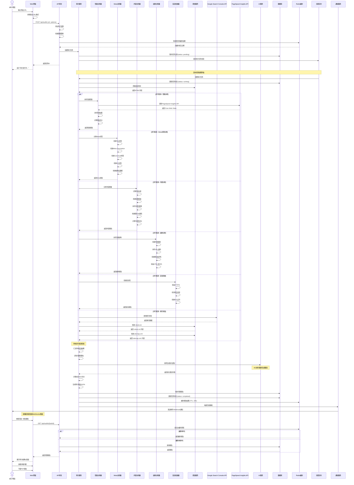
```mermaid
sequenceDiagram
    actor User as SEO专员
    participant UI as Web界面
    participant API as API网关
    participant AuditSvc as 审计服务
    participant PerfAnalyzer as 性能分析器
    participant MetaAnalyzer as Meta分析器
    participant ContentAnalyzer as 内容分析器
    participant StructAnalyzer as 结构分析器
    participant SecurityChecker as 安全检查器
    participant Crawler as 爬虫服务
    participant GSC as Google Search Console API
    participant PSI as PageSpeed Insights API
    participant AI as AI服务
    participant DB as 数据库
    participant Cache as Redis缓存
    participant Queue as 消息队列
    participant Notification as 通知服务

    User->>UI: 输入网站URL
    UI->>UI: 前端验证URL格式
    UI->>API: POST /api/audits {url, options}

    API->>API: 验证用户权限
    API->>API: 检查配额限制

    API->>Cache: 检查是否有缓存结果
    Cache-->>API: 无缓存或已过期

    API->>AuditSvc: 创建审计任务
    AuditSvc->>DB: 保存任务记录 (status: pending)
    AuditSvc->>Queue: 发布审计任务消息

    API-->>UI: 返回任务ID
    UI-->>User: 显示"审计进行中..."

    Note over Queue,AuditSvc: 异步任务处理开始

    Queue->>AuditSvc: 消费审计任务
    AuditSvc->>DB: 更新任务状态 (status: running)
    AuditSvc->>Crawler: 抓取目标网页
    Crawler-->>AuditSvc: 返回HTML内容

    par 并行检测 - 性能分析
        AuditSvc->>PerfAnalyzer: 分析页面性能
        PerfAnalyzer->>PSI: 调用 PageSpeed Insights API
        PSI-->>PerfAnalyzer: 返回 Core Web Vitals
        PerfAnalyzer->>PerfAnalyzer: 分析资源加载
        PerfAnalyzer->>PerfAnalyzer: 计算性能评分
        PerfAnalyzer-->>AuditSvc: 返回性能报告
    and 并行检测 - Meta标签分析
        AuditSvc->>MetaAnalyzer: 分析Meta标签
        MetaAnalyzer->>MetaAnalyzer: 检查Title标签
        MetaAnalyzer->>MetaAnalyzer: 检查Meta Description
        MetaAnalyzer->>MetaAnalyzer: 检查Canonical标签
        MetaAnalyzer->>MetaAnalyzer: 检查OG标签
        MetaAnalyzer->>MetaAnalyzer: 检查结构化数据
        MetaAnalyzer-->>AuditSvc: 返回Meta报告
    and 并行检测 - 内容分析
        AuditSvc->>ContentAnalyzer: 分析内容质量
        ContentAnalyzer->>ContentAnalyzer: 计算内容长度
        ContentAnalyzer->>ContentAnalyzer: 检查标题层级
        ContentAnalyzer->>ContentAnalyzer: 分析关键词密度
        ContentAnalyzer->>ContentAnalyzer: 检查图片Alt属性
        ContentAnalyzer->>ContentAnalyzer: 计算可读性评分
        ContentAnalyzer-->>AuditSvc: 返回内容报告
    and 并行检测 - 结构分析
        AuditSvc->>StructAnalyzer: 分析页面结构
        StructAnalyzer->>StructAnalyzer: 检查内部链接
        StructAnalyzer->>StructAnalyzer: 分析URL结构
        StructAnalyzer->>StructAnalyzer: 检查移动友好性
        StructAnalyzer->>StructAnalyzer: 验证HTML语义化
        StructAnalyzer-->>AuditSvc: 返回结构报告
    and 并行检测 - 安全检查
        AuditSvc->>SecurityChecker: 检查安全性
        SecurityChecker->>SecurityChecker: 验证HTTPS
        SecurityChecker->>SecurityChecker: 检测混合内容
        SecurityChecker->>SecurityChecker: 检查SSL证书
        SecurityChecker-->>AuditSvc: 返回安全报告
    and 并行检测 - 索引状态
        AuditSvc->>GSC: 查询索引状态
        GSC-->>AuditSvc: 返回索引数据
        AuditSvc->>Crawler: 检查 robots.txt
        Crawler-->>AuditSvc: 返回 robots.txt 内容
        AuditSvc->>Crawler: 检查 sitemap.xml
        Crawler-->>AuditSvc: 返回 sitemap.xml 内容
    end

    Note over AuditSvc: 所有并行检测完成

    AuditSvc->>AuditSvc: 汇总所有检测结果
    AuditSvc->>AuditSvc: 识别问题和警告

    AuditSvc->>AI: 请求生成优化建议
    Note over AI: AI分析问题并生成建议
    AI-->>AuditSvc: 返回优化建议列表

    AuditSvc->>AuditSvc: 计算综合SEO评分
    AuditSvc->>AuditSvc: 生成审计报告JSON

    AuditSvc->>DB: 保存完整报告
    AuditSvc->>DB: 更新任务状态 (status: completed)
    AuditSvc->>Cache: 缓存报告结果 (TTL: 24h)

    AuditSvc->>Notification: 触发完成通知
    Notification->>User: 发送邮件/Webhook通知

    Note over UI: 前端轮询状态或WebSocket推送

    User->>UI: 刷新页面 / 收到通知
    UI->>API: GET /api/audits/{taskId}
    API->>Cache: 尝试从缓存获取
    alt 缓存命中
        Cache-->>API: 返回缓存报告
    else 缓存未命中
        API->>DB: 查询报告
        DB-->>API: 返回报告
    end
    API-->>UI: 返回完整报告
    UI-->>User: 展示审计结果仪表盘

    User->>UI: 查看详细问题
    User->>UI: 下载PDF报告
```

### 1.2 审计失败处理流程

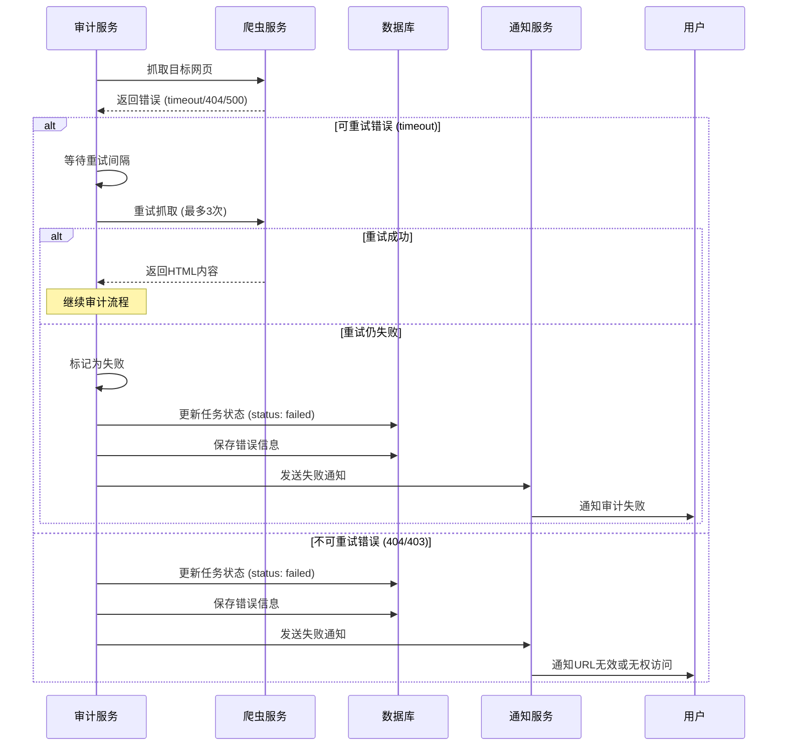
```mermaid
sequenceDiagram
    participant AuditSvc as 审计服务
    participant Crawler as 爬虫服务
    participant DB as 数据库
    participant Notification as 通知服务
    participant User as 用户

    AuditSvc->>Crawler: 抓取目标网页
    Crawler-->>AuditSvc: 返回错误 (timeout/404/500)

    alt 可重试错误 (timeout)
        AuditSvc->>AuditSvc: 等待重试间隔
        AuditSvc->>Crawler: 重试抓取 (最多3次)
        alt 重试成功
            Crawler-->>AuditSvc: 返回HTML内容
            Note over AuditSvc: 继续审计流程
        else 重试仍失败
            AuditSvc->>AuditSvc: 标记为失败
            AuditSvc->>DB: 更新任务状态 (status: failed)
            AuditSvc->>DB: 保存错误信息
            AuditSvc->>Notification: 发送失败通知
            Notification->>User: 通知审计失败
        end
    else 不可重试错误 (404/403)
        AuditSvc->>DB: 更新任务状态 (status: failed)
        AuditSvc->>DB: 保存错误信息
        AuditSvc->>Notification: 发送失败通知
        Notification->>User: 通知URL无效或无权访问
    end
```

---

## 2. 关键词研究时序图

### 2.1 关键词挖掘流程

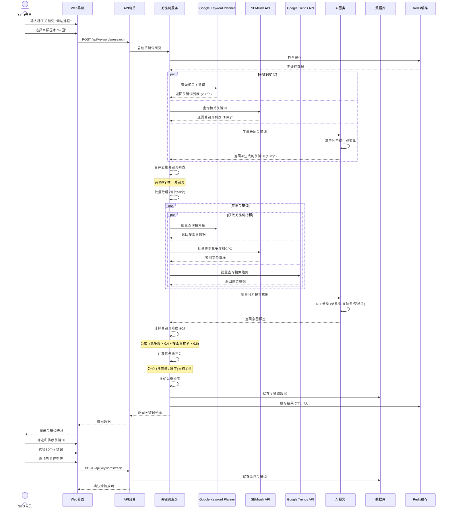
```mermaid
sequenceDiagram
    actor User as SEO专员
    participant UI as Web界面
    participant API as API网关
    participant KeywordSvc as 关键词服务
    participant GoogleKP as Google Keyword Planner
    participant SEMrush as SEMrush API
    participant GoogleTrends as Google Trends API
    participant AI as AI服务
    participant DB as 数据库
    participant Cache as Redis缓存

    User->>UI: 输入种子关键词 "网站建设"
    User->>UI: 选择目标国家 "中国"
    UI->>API: POST /api/keywords/research

    API->>KeywordSvc: 启动关键词研究
    KeywordSvc->>Cache: 检查缓存
    Cache-->>KeywordSvc: 无缓存数据

    par 关键词扩展
        KeywordSvc->>GoogleKP: 查询相关关键词
        GoogleKP-->>KeywordSvc: 返回关键词列表 (200个)
    and
        KeywordSvc->>SEMrush: 查询相关关键词
        SEMrush-->>KeywordSvc: 返回关键词列表 (150个)
    and
        KeywordSvc->>AI: 生成长尾关键词
        AI->>AI: 基于种子词生成变体
        AI-->>KeywordSvc: 返回AI生成的关键词 (100个)
    end

    KeywordSvc->>KeywordSvc: 合并去重关键词列表
    Note over KeywordSvc: 共350个唯一关键词

    KeywordSvc->>KeywordSvc: 批量分组 (每批50个)

    loop 每批关键词
        par 获取关键词指标
            KeywordSvc->>GoogleKP: 批量查询搜索量
            GoogleKP-->>KeywordSvc: 返回搜索量数据
        and
            KeywordSvc->>SEMrush: 批量查询竞争度和CPC
            SEMrush-->>KeywordSvc: 返回竞争指标
        and
            KeywordSvc->>GoogleTrends: 批量查询搜索趋势
            GoogleTrends-->>KeywordSvc: 返回趋势数据
        end
    end

    KeywordSvc->>AI: 批量分析搜索意图
    AI->>AI: NLP分类 (信息型/导航型/交易型)
    AI-->>KeywordSvc: 返回意图标签

    KeywordSvc->>KeywordSvc: 计算关键词难度评分
    Note over KeywordSvc: 公式: (竞争度 × 0.4 + 搜索量排名 × 0.6)

    KeywordSvc->>KeywordSvc: 计算优先级评分
    Note over KeywordSvc: 公式: (搜索量 / 难度) × 相关性

    KeywordSvc->>KeywordSvc: 按优先级排序

    KeywordSvc->>DB: 保存关键词数据
    KeywordSvc->>Cache: 缓存结果 (TTL: 7天)

    KeywordSvc-->>API: 返回关键词列表
    API-->>UI: 返回数据
    UI-->>User: 展示关键词表格

    User->>UI: 筛选和排序关键词
    User->>UI: 选择50个关键词
    User->>UI: 添加到监控列表
    UI->>API: POST /api/keywords/track
    API->>DB: 保存监控关键词
    API-->>UI: 确认添加成功
```

### 2.2 关键词分组流程

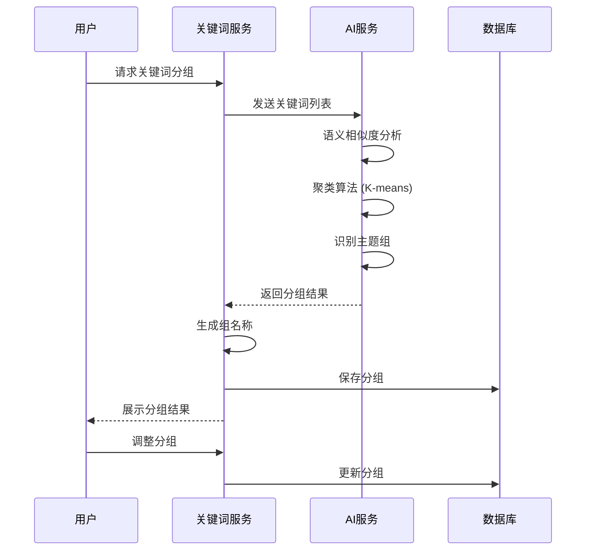
```mermaid
sequenceDiagram
    participant User as 用户
    participant KeywordSvc as 关键词服务
    participant AI as AI服务
    participant DB as 数据库

    User->>KeywordSvc: 请求关键词分组
    KeywordSvc->>AI: 发送关键词列表

    AI->>AI: 语义相似度分析
    AI->>AI: 聚类算法 (K-means)
    AI->>AI: 识别主题组

    AI-->>KeywordSvc: 返回分组结果
    KeywordSvc->>KeywordSvc: 生成组名称
    KeywordSvc->>DB: 保存分组
    KeywordSvc-->>User: 展示分组结果

    User->>KeywordSvc: 调整分组
    KeywordSvc->>DB: 更新分组
```

---

## 3. 排名监控时序图

### 3.1 定时排名检查流程

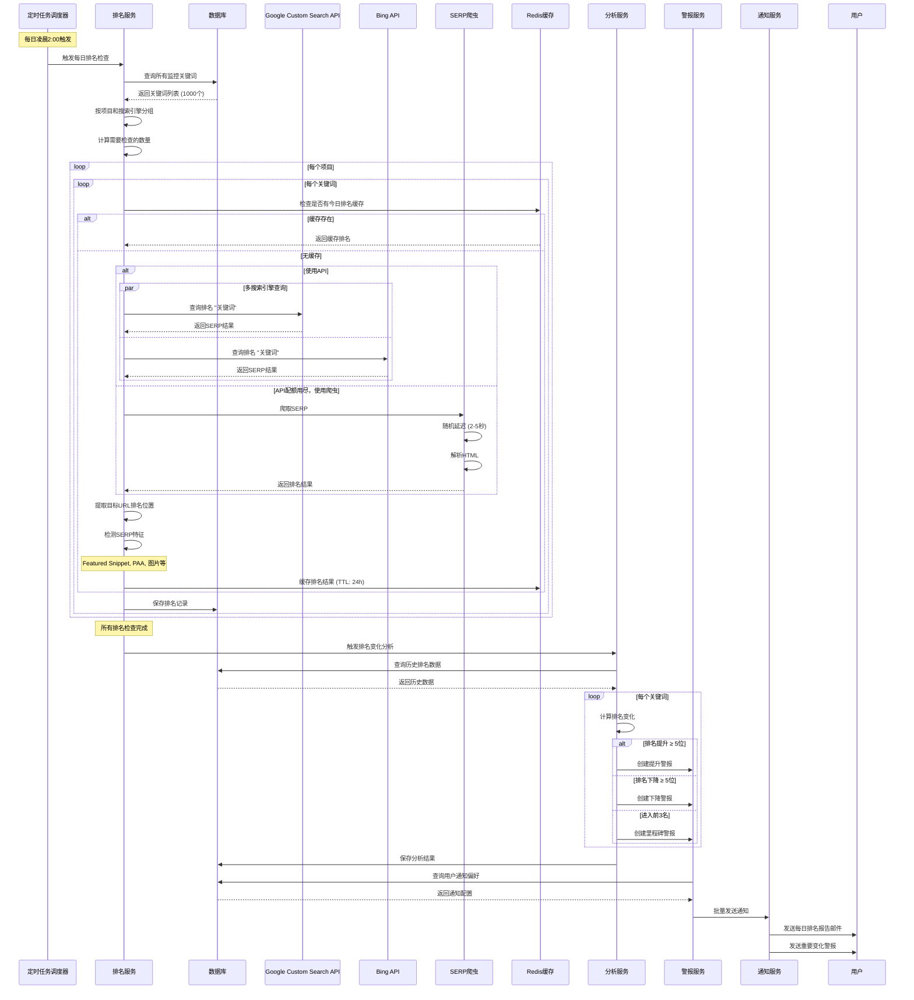
```mermaid
sequenceDiagram
    participant Scheduler as 定时任务调度器
    participant RankSvc as 排名服务
    participant DB as 数据库
    participant GoogleAPI as Google Custom Search API
    participant BingAPI as Bing API
    participant Crawler as SERP爬虫
    participant Cache as Redis缓存
    participant Analytics as 分析服务
    participant Alert as 警报服务
    participant Notification as 通知服务
    participant User as 用户

    Note over Scheduler: 每日凌晨2:00触发

    Scheduler->>RankSvc: 触发每日排名检查
    RankSvc->>DB: 查询所有监控关键词
    DB-->>RankSvc: 返回关键词列表 (1000个)

    RankSvc->>RankSvc: 按项目和搜索引擎分组
    RankSvc->>RankSvc: 计算需要检查的数量

    loop 每个项目
        loop 每个关键词
            RankSvc->>Cache: 检查是否有今日排名缓存
            alt 缓存存在
                Cache-->>RankSvc: 返回缓存排名
            else 无缓存
                alt 使用API
                    par 多搜索引擎查询
                        RankSvc->>GoogleAPI: 查询排名 "关键词"
                        GoogleAPI-->>RankSvc: 返回SERP结果
                    and
                        RankSvc->>BingAPI: 查询排名 "关键词"
                        BingAPI-->>RankSvc: 返回SERP结果
                    end
                else API配额用尽，使用爬虫
                    RankSvc->>Crawler: 爬取SERP
                    Crawler->>Crawler: 随机延迟 (2-5秒)
                    Crawler->>Crawler: 解析HTML
                    Crawler-->>RankSvc: 返回排名结果
                end

                RankSvc->>RankSvc: 提取目标URL排名位置
                RankSvc->>RankSvc: 检测SERP特征
                Note over RankSvc: Featured Snippet, PAA, 图片等

                RankSvc->>Cache: 缓存排名结果 (TTL: 24h)
            end

            RankSvc->>DB: 保存排名记录
        end
    end

    Note over RankSvc: 所有排名检查完成

    RankSvc->>Analytics: 触发排名变化分析
    Analytics->>DB: 查询历史排名数据
    DB-->>Analytics: 返回历史数据

    loop 每个关键词
        Analytics->>Analytics: 计算排名变化
        alt 排名提升 ≥ 5位
            Analytics->>Alert: 创建提升警报
        else 排名下降 ≥ 5位
            Analytics->>Alert: 创建下降警报
        else 进入前3名
            Analytics->>Alert: 创建里程碑警报
        end
    end

    Analytics->>DB: 保存分析结果

    Alert->>DB: 查询用户通知偏好
    DB-->>Alert: 返回通知配置

    Alert->>Notification: 批量发送通知
    Notification->>User: 发送每日排名报告邮件
    Notification->>User: 发送重要变化警报
```

### 3.2 实时排名查询流程

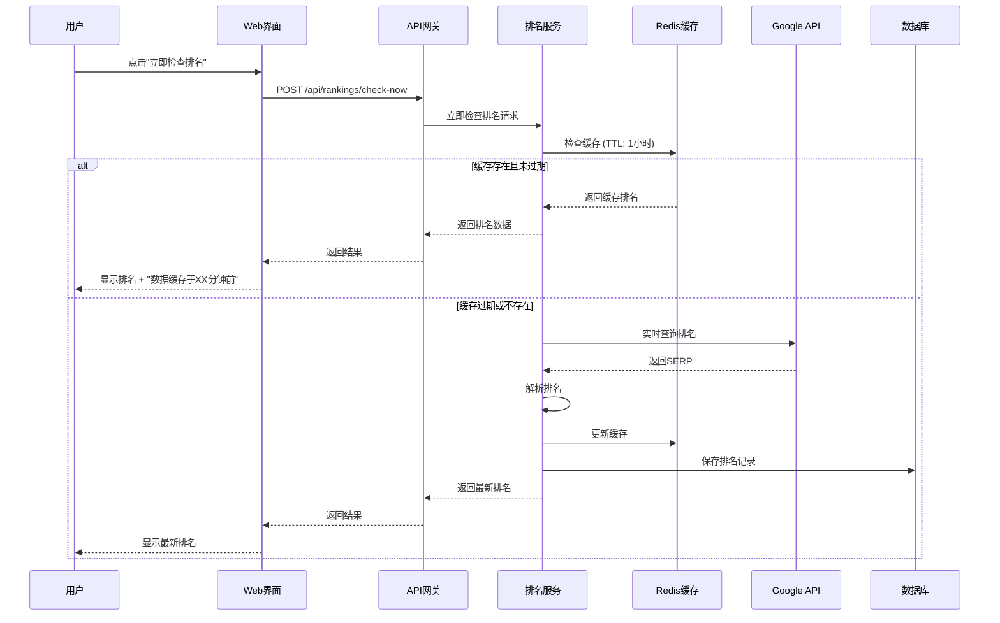
```mermaid
sequenceDiagram
    participant User as 用户
    participant UI as Web界面
    participant API as API网关
    participant RankSvc as 排名服务
    participant Cache as Redis缓存
    participant GoogleAPI as Google API
    participant DB as 数据库

    User->>UI: 点击"立即检查排名"
    UI->>API: POST /api/rankings/check-now

    API->>RankSvc: 立即检查排名请求
    RankSvc->>Cache: 检查缓存 (TTL: 1小时)

    alt 缓存存在且未过期
        Cache-->>RankSvc: 返回缓存排名
        RankSvc-->>API: 返回排名数据
        API-->>UI: 返回结果
        UI-->>User: 显示排名 + "数据缓存于XX分钟前"
    else 缓存过期或不存在
        RankSvc->>GoogleAPI: 实时查询排名
        GoogleAPI-->>RankSvc: 返回SERP
        RankSvc->>RankSvc: 解析排名
        RankSvc->>Cache: 更新缓存
        RankSvc->>DB: 保存排名记录
        RankSvc-->>API: 返回最新排名
        API-->>UI: 返回结果
        UI-->>User: 显示最新排名
    end
```

---

## 4. 内容优化时序图

### 4.1 内容分析与优化建议流程

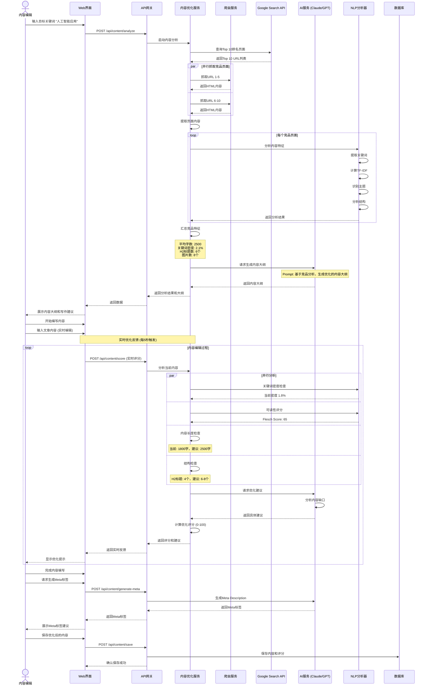
```mermaid
sequenceDiagram
    actor User as 内容编辑
    participant UI as Web界面
    participant API as API网关
    participant ContentSvc as 内容优化服务
    participant Crawler as 爬虫服务
    participant GoogleAPI as Google Search API
    participant AI as AI服务 (Claude/GPT)
    participant NLP as NLP分析器
    participant DB as 数据库

    User->>UI: 输入目标关键词 "人工智能应用"
    UI->>API: POST /api/content/analyze

    API->>ContentSvc: 启动内容分析
    ContentSvc->>GoogleAPI: 查询Top 10排名页面
    GoogleAPI-->>ContentSvc: 返回Top 10 URL列表

    par 并行抓取竞品页面
        ContentSvc->>Crawler: 抓取URL 1-5
        Crawler-->>ContentSvc: 返回HTML内容
    and
        ContentSvc->>Crawler: 抓取URL 6-10
        Crawler-->>ContentSvc: 返回HTML内容
    end

    ContentSvc->>ContentSvc: 提取页面内容

    loop 每个竞品页面
        ContentSvc->>NLP: 分析内容特征
        NLP->>NLP: 提取关键词
        NLP->>NLP: 计算TF-IDF
        NLP->>NLP: 识别主题
        NLP->>NLP: 分析结构
        NLP-->>ContentSvc: 返回分析结果
    end

    ContentSvc->>ContentSvc: 汇总竞品特征
    Note over ContentSvc: 平均字数: 2500<br/>关键词密度: 2.1%<br/>H2标题数: 6个<br/>图片数: 8个

    ContentSvc->>AI: 请求生成内容大纲
    Note over AI: Prompt: 基于竞品分析，生成优化的内容大纲
    AI-->>ContentSvc: 返回内容大纲

    ContentSvc-->>API: 返回分析结果和大纲
    API-->>UI: 返回数据
    UI-->>User: 展示内容大纲和写作建议

    User->>UI: 开始编写内容
    User->>UI: 输入文章内容 (实时编辑)

    Note over UI,ContentSvc: 实时优化反馈 (每5秒触发)

    loop 内容编辑过程
        UI->>API: POST /api/content/score (实时评分)
        API->>ContentSvc: 分析当前内容

        par 并行分析
            ContentSvc->>NLP: 关键词密度检查
            NLP-->>ContentSvc: 当前密度 1.8%
        and
            ContentSvc->>NLP: 可读性评分
            NLP-->>ContentSvc: Flesch Score: 65
        and
            ContentSvc->>ContentSvc: 内容长度检查
            Note over ContentSvc: 当前: 1800字，建议: 2500字
        and
            ContentSvc->>ContentSvc: 结构检查
            Note over ContentSvc: H2标题: 4个，建议: 6-8个
        end

        ContentSvc->>AI: 请求优化建议
        AI->>AI: 分析内容缺口
        AI-->>ContentSvc: 返回具体建议

        ContentSvc->>ContentSvc: 计算优化评分 (0-100)
        ContentSvc-->>API: 返回评分和建议
        API-->>UI: 返回实时反馈
        UI-->>User: 显示优化提示
    end

    User->>UI: 完成内容编写
    User->>UI: 请求生成Meta标签

    UI->>API: POST /api/content/generate-meta
    API->>AI: 生成Meta Description
    AI-->>API: 返回Meta标签
    API-->>UI: 返回Meta标签
    UI-->>User: 展示Meta标签建议

    User->>UI: 保存优化后的内容
    UI->>API: POST /api/content/save
    API->>DB: 保存内容和评分
    API-->>UI: 确认保存成功
```

### 4.2 AI内容生成流程

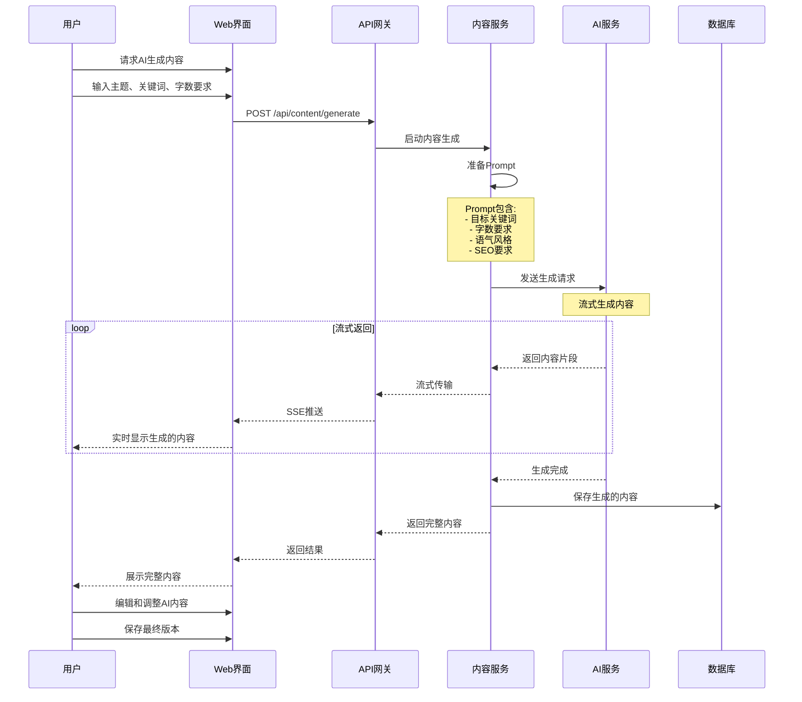
```mermaid
sequenceDiagram
    participant User as 用户
    participant UI as Web界面
    participant API as API网关
    participant ContentSvc as 内容服务
    participant AI as AI服务
    participant DB as 数据库

    User->>UI: 请求AI生成内容
    User->>UI: 输入主题、关键词、字数要求

    UI->>API: POST /api/content/generate
    API->>ContentSvc: 启动内容生成

    ContentSvc->>ContentSvc: 准备Prompt
    Note over ContentSvc: Prompt包含:<br/>- 目标关键词<br/>- 字数要求<br/>- 语气风格<br/>- SEO要求

    ContentSvc->>AI: 发送生成请求
    Note over AI: 流式生成内容

    loop 流式返回
        AI-->>ContentSvc: 返回内容片段
        ContentSvc-->>API: 流式传输
        API-->>UI: SSE推送
        UI-->>User: 实时显示生成的内容
    end

    AI-->>ContentSvc: 生成完成
    ContentSvc->>DB: 保存生成的内容
    ContentSvc-->>API: 返回完整内容
    API-->>UI: 返回结果
    UI-->>User: 展示完整内容

    User->>UI: 编辑和调整AI内容
    User->>UI: 保存最终版本
```

---

## 5. 竞品分析时序图

### 5.1 竞品发现和数据收集流程

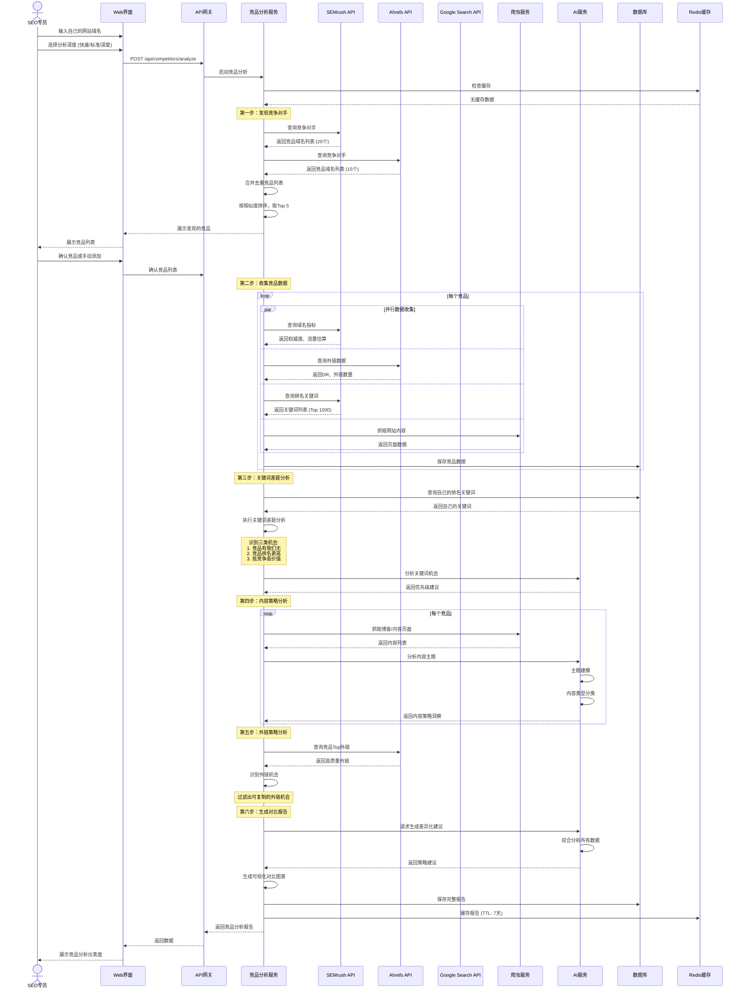
```mermaid
sequenceDiagram
    actor User as SEO专员
    participant UI as Web界面
    participant API as API网关
    participant CompSvc as 竞品分析服务
    participant SEMrush as SEMrush API
    participant Ahrefs as Ahrefs API
    participant GoogleAPI as Google Search API
    participant Crawler as 爬虫服务
    participant AI as AI服务
    participant DB as 数据库
    participant Cache as Redis缓存

    User->>UI: 输入自己的网站域名
    User->>UI: 选择分析深度 (快速/标准/深度)
    UI->>API: POST /api/competitors/analyze

    API->>CompSvc: 启动竞品分析
    CompSvc->>Cache: 检查缓存
    Cache-->>CompSvc: 无缓存数据

    Note over CompSvc: 第一步：发现竞争对手

    CompSvc->>SEMrush: 查询竞争对手
    SEMrush-->>CompSvc: 返回竞品域名列表 (20个)

    CompSvc->>Ahrefs: 查询竞争对手
    Ahrefs-->>CompSvc: 返回竞品域名列表 (15个)

    CompSvc->>CompSvc: 合并去重竞品列表
    CompSvc->>CompSvc: 按相似度排序，取Top 5

    CompSvc-->>UI: 展示发现的竞品
    UI-->>User: 展示竞品列表
    User->>UI: 确认竞品或手动添加
    UI->>API: 确认竞品列表

    Note over CompSvc: 第二步：收集竞品数据

    loop 每个竞品
        par 并行数据收集
            CompSvc->>SEMrush: 查询域名指标
            SEMrush-->>CompSvc: 返回权威度、流量估算
        and
            CompSvc->>Ahrefs: 查询外链数据
            Ahrefs-->>CompSvc: 返回DR、外链数量
        and
            CompSvc->>SEMrush: 查询排名关键词
            SEMrush-->>CompSvc: 返回关键词列表 (Top 1000)
        and
            CompSvc->>Crawler: 抓取网站内容
            Crawler-->>CompSvc: 返回页面数据
        end

        CompSvc->>DB: 保存竞品数据
    end

    Note over CompSvc: 第三步：关键词差距分析

    CompSvc->>DB: 查询自己的排名关键词
    DB-->>CompSvc: 返回自己的关键词

    CompSvc->>CompSvc: 执行关键词差距分析
    Note over CompSvc: 识别三类机会:<br/>1. 竞品有我们无<br/>2. 竞品排名更高<br/>3. 低竞争高价值

    CompSvc->>AI: 分析关键词机会
    AI-->>CompSvc: 返回优先级建议

    Note over CompSvc: 第四步：内容策略分析

    loop 每个竞品
        CompSvc->>Crawler: 抓取博客/内容页面
        Crawler-->>CompSvc: 返回内容列表

        CompSvc->>AI: 分析内容主题
        AI->>AI: 主题建模
        AI->>AI: 内容类型分类
        AI-->>CompSvc: 返回内容策略洞察
    end

    Note over CompSvc: 第五步：外链策略分析

    CompSvc->>Ahrefs: 查询竞品Top外链
    Ahrefs-->>CompSvc: 返回高质量外链

    CompSvc->>CompSvc: 识别外链机会
    Note over CompSvc: 过滤出可复制的外链机会

    Note over CompSvc: 第六步：生成对比报告

    CompSvc->>AI: 请求生成差异化建议
    AI->>AI: 综合分析所有数据
    AI-->>CompSvc: 返回策略建议

    CompSvc->>CompSvc: 生成可视化对比图表
    CompSvc->>DB: 保存完整报告
    CompSvc->>Cache: 缓存报告 (TTL: 7天)

    CompSvc-->>API: 返回竞品分析报告
    API-->>UI: 返回数据
    UI-->>User: 展示竞品分析仪表盘
```

### 5.2 竞品监控更新流程

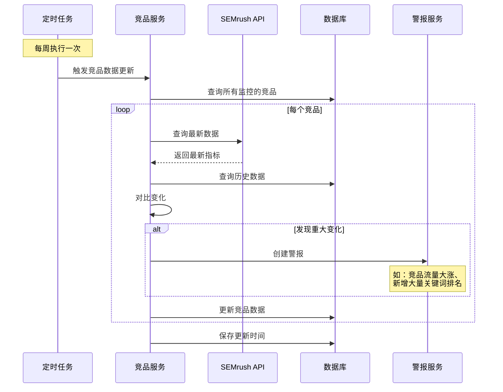
```mermaid
sequenceDiagram
    participant Scheduler as 定时任务
    participant CompSvc as 竞品服务
    participant SEMrush as SEMrush API
    participant DB as 数据库
    participant Alert as 警报服务

    Note over Scheduler: 每周执行一次

    Scheduler->>CompSvc: 触发竞品数据更新
    CompSvc->>DB: 查询所有监控的竞品

    loop 每个竞品
        CompSvc->>SEMrush: 查询最新数据
        SEMrush-->>CompSvc: 返回最新指标

        CompSvc->>DB: 查询历史数据
        CompSvc->>CompSvc: 对比变化

        alt 发现重大变化
            CompSvc->>Alert: 创建警报
            Note over Alert: 如：竞品流量大涨、<br/>新增大量关键词排名
        end

        CompSvc->>DB: 更新竞品数据
    end

    CompSvc->>DB: 保存更新时间
```

---

## 6. 外链分析时序图

### 6.1 外链数据收集与分析流程

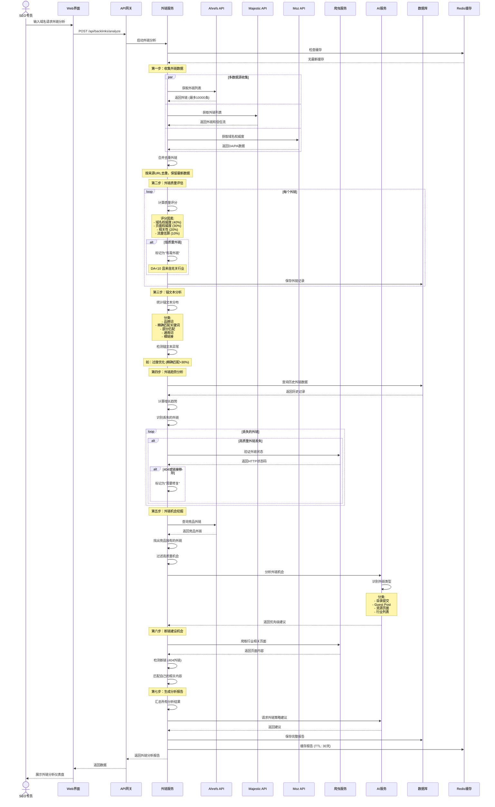
```mermaid
sequenceDiagram
    actor User as SEO专员
    participant UI as Web界面
    participant API as API网关
    participant BacklinkSvc as 外链服务
    participant Ahrefs as Ahrefs API
    participant Majestic as Majestic API
    participant Moz as Moz API
    participant Crawler as 爬虫服务
    participant AI as AI服务
    participant DB as 数据库
    participant Cache as Redis缓存

    User->>UI: 输入域名请求外链分析
    UI->>API: POST /api/backlinks/analyze

    API->>BacklinkSvc: 启动外链分析
    BacklinkSvc->>Cache: 检查缓存
    Cache-->>BacklinkSvc: 无最新缓存

    Note over BacklinkSvc: 第一步：收集外链数据

    par 多数据源收集
        BacklinkSvc->>Ahrefs: 获取外链列表
        Ahrefs-->>BacklinkSvc: 返回外链 (最多10000条)
    and
        BacklinkSvc->>Majestic: 获取外链列表
        Majestic-->>BacklinkSvc: 返回外链和信任流
    and
        BacklinkSvc->>Moz: 获取域名权威度
        Moz-->>BacklinkSvc: 返回DA/PA数据
    end

    BacklinkSvc->>BacklinkSvc: 合并去重外链
    Note over BacklinkSvc: 按来源URL去重，保留最新数据

    Note over BacklinkSvc: 第二步：外链质量评估

    loop 每个外链
        BacklinkSvc->>BacklinkSvc: 计算质量评分
        Note over BacklinkSvc: 评分因素:<br/>- 域名权威度 (40%)<br/>- 页面权威度 (30%)<br/>- 相关性 (20%)<br/>- 流量估算 (10%)

        alt 低质量外链
            BacklinkSvc->>BacklinkSvc: 标记为"有毒外链"
            Note over BacklinkSvc: DA<10 且来自无关行业
        end

        BacklinkSvc->>DB: 保存外链记录
    end

    Note over BacklinkSvc: 第三步：锚文本分析

    BacklinkSvc->>BacklinkSvc: 统计锚文本分布
    Note over BacklinkSvc: 分类:<br/>- 品牌词<br/>- 精确匹配关键词<br/>- 部分匹配<br/>- 通用词<br/>- 裸链接

    BacklinkSvc->>BacklinkSvc: 检测锚文本异常
    Note over BacklinkSvc: 如：过度优化 (精确匹配>30%)

    Note over BacklinkSvc: 第四步：外链趋势分析

    BacklinkSvc->>DB: 查询历史外链数据
    DB-->>BacklinkSvc: 返回历史记录

    BacklinkSvc->>BacklinkSvc: 计算增长趋势
    BacklinkSvc->>BacklinkSvc: 识别丢失的外链

    loop 丢失的外链
        alt 高质量外链丢失
            BacklinkSvc->>Crawler: 验证外链状态
            Crawler-->>BacklinkSvc: 返回HTTP状态码
            alt 404或链接移除
                BacklinkSvc->>BacklinkSvc: 标记为"需要修复"
            end
        end
    end

    Note over BacklinkSvc: 第五步：外链机会挖掘

    BacklinkSvc->>Ahrefs: 查询竞品外链
    Ahrefs-->>BacklinkSvc: 返回竞品外链

    BacklinkSvc->>BacklinkSvc: 找出竞品独有的外链
    BacklinkSvc->>BacklinkSvc: 过滤高质量机会

    BacklinkSvc->>AI: 分析外链机会
    AI->>AI: 识别外链类型
    Note over AI: 分类:<br/>- 目录提交<br/>- Guest Post<br/>- 资源页面<br/>- 行业列表

    AI-->>BacklinkSvc: 返回优先级建议

    Note over BacklinkSvc: 第六步：断链建设机会

    BacklinkSvc->>Crawler: 爬取行业相关页面
    Crawler-->>BacklinkSvc: 返回页面内容

    BacklinkSvc->>BacklinkSvc: 检测断链 (404外链)
    BacklinkSvc->>BacklinkSvc: 匹配自己的相关内容

    Note over BacklinkSvc: 第七步：生成分析报告

    BacklinkSvc->>BacklinkSvc: 汇总所有分析结果
    BacklinkSvc->>AI: 请求外链策略建议
    AI-->>BacklinkSvc: 返回建议

    BacklinkSvc->>DB: 保存完整报告
    BacklinkSvc->>Cache: 缓存报告 (TTL: 30天)

    BacklinkSvc-->>API: 返回外链分析报告
    API-->>UI: 返回数据
    UI-->>User: 展示外链分析仪表盘
```

### 6.2 外链监控流程

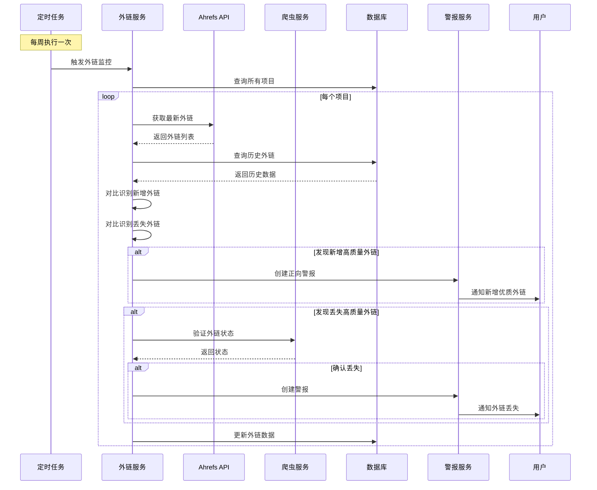
```mermaid
sequenceDiagram
    participant Scheduler as 定时任务
    participant BacklinkSvc as 外链服务
    participant Ahrefs as Ahrefs API
    participant Crawler as 爬虫服务
    participant DB as 数据库
    participant Alert as 警报服务
    participant User as 用户

    Note over Scheduler: 每周执行一次

    Scheduler->>BacklinkSvc: 触发外链监控
    BacklinkSvc->>DB: 查询所有项目

    loop 每个项目
        BacklinkSvc->>Ahrefs: 获取最新外链
        Ahrefs-->>BacklinkSvc: 返回外链列表

        BacklinkSvc->>DB: 查询历史外链
        DB-->>BacklinkSvc: 返回历史数据

        BacklinkSvc->>BacklinkSvc: 对比识别新增外链
        BacklinkSvc->>BacklinkSvc: 对比识别丢失外链

        alt 发现新增高质量外链
            BacklinkSvc->>Alert: 创建正向警报
            Alert->>User: 通知新增优质外链
        end

        alt 发现丢失高质量外链
            BacklinkSvc->>Crawler: 验证外链状态
            Crawler-->>BacklinkSvc: 返回状态

            alt 确认丢失
                BacklinkSvc->>Alert: 创建警报
                Alert->>User: 通知外链丢失
            end
        end

        BacklinkSvc->>DB: 更新外链数据
    end
```

---

## 7. 报告生成时序图

### 7.1 自定义报告生成流程

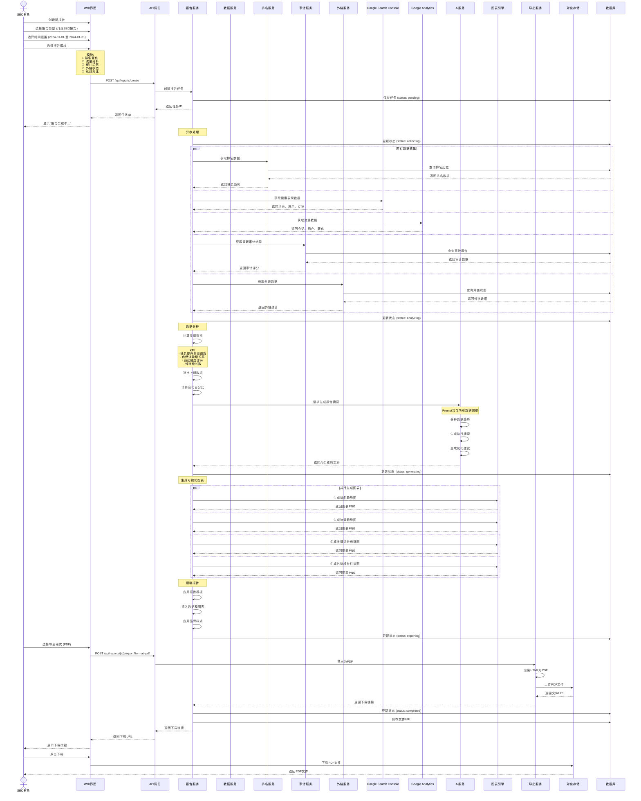
```mermaid
sequenceDiagram
    actor User as SEO专员
    participant UI as Web界面
    participant API as API网关
    participant ReportSvc as 报告服务
    participant DataSvc as 数据服务
    participant RankSvc as 排名服务
    participant AuditSvc as 审计服务
    participant BacklinkSvc as 外链服务
    participant GSC as Google Search Console
    participant GA as Google Analytics
    participant AI as AI服务
    participant ChartEngine as 图表引擎
    participant ExportSvc as 导出服务
    participant Storage as 对象存储
    participant DB as 数据库

    User->>UI: 创建新报告
    User->>UI: 选择报告类型 (月度SEO报告)
    User->>UI: 选择时间范围 (2024-01-01 至 2024-01-31)
    User->>UI: 选择报告模块
    Note over UI: 模块:<br/>□ 排名变化<br/>☑ 流量分析<br/>☑ 审计结果<br/>☑ 外链状态<br/>☑ 竞品对比

    UI->>API: POST /api/reports/create
    API->>ReportSvc: 创建报告任务
    ReportSvc->>DB: 保存任务 (status: pending)

    ReportSvc-->>API: 返回任务ID
    API-->>UI: 返回任务ID
    UI-->>User: 显示"报告生成中..."

    Note over ReportSvc: 异步处理

    ReportSvc->>DB: 更新状态 (status: collecting)

    par 并行数据收集
        ReportSvc->>RankSvc: 获取排名数据
        RankSvc->>DB: 查询排名历史
        DB-->>RankSvc: 返回排名数据
        RankSvc-->>ReportSvc: 返回排名趋势
    and
        ReportSvc->>GSC: 获取搜索表现数据
        GSC-->>ReportSvc: 返回点击、展示、CTR
    and
        ReportSvc->>GA: 获取流量数据
        GA-->>ReportSvc: 返回会话、用户、转化
    and
        ReportSvc->>AuditSvc: 获取最新审计结果
        AuditSvc->>DB: 查询审计报告
        DB-->>AuditSvc: 返回审计数据
        AuditSvc-->>ReportSvc: 返回审计评分
    and
        ReportSvc->>BacklinkSvc: 获取外链数据
        BacklinkSvc->>DB: 查询外链状态
        DB-->>BacklinkSvc: 返回外链数据
        BacklinkSvc-->>ReportSvc: 返回外链统计
    end

    ReportSvc->>DB: 更新状态 (status: analyzing)

    Note over ReportSvc: 数据分析

    ReportSvc->>ReportSvc: 计算关键指标
    Note over ReportSvc: KPI:<br/>- 排名提升关键词数<br/>- 自然流量增长率<br/>- SEO健康评分<br/>- 外链增长数

    ReportSvc->>ReportSvc: 对比上期数据
    ReportSvc->>ReportSvc: 计算变化百分比

    ReportSvc->>AI: 请求生成报告摘要
    Note over AI: Prompt包含所有数据洞察
    AI->>AI: 分析数据趋势
    AI->>AI: 生成执行摘要
    AI->>AI: 生成优化建议
    AI-->>ReportSvc: 返回AI生成的文本

    ReportSvc->>DB: 更新状态 (status: generating)

    Note over ReportSvc: 生成可视化图表

    par 并行生成图表
        ReportSvc->>ChartEngine: 生成排名趋势图
        ChartEngine-->>ReportSvc: 返回图表PNG
    and
        ReportSvc->>ChartEngine: 生成流量趋势图
        ChartEngine-->>ReportSvc: 返回图表PNG
    and
        ReportSvc->>ChartEngine: 生成关键词分布饼图
        ChartEngine-->>ReportSvc: 返回图表PNG
    and
        ReportSvc->>ChartEngine: 生成外链增长柱状图
        ChartEngine-->>ReportSvc: 返回图表PNG
    end

    Note over ReportSvc: 组装报告

    ReportSvc->>ReportSvc: 应用报告模板
    ReportSvc->>ReportSvc: 插入数据和图表
    ReportSvc->>ReportSvc: 应用品牌样式

    ReportSvc->>DB: 更新状态 (status: exporting)

    User->>UI: 选择导出格式 (PDF)
    UI->>API: POST /api/reports/{id}/export?format=pdf

    API->>ExportSvc: 导出为PDF
    ExportSvc->>ExportSvc: 渲染HTML为PDF
    ExportSvc->>Storage: 上传PDF文件
    Storage-->>ExportSvc: 返回文件URL

    ExportSvc-->>ReportSvc: 返回下载链接
    ReportSvc->>DB: 更新状态 (status: completed)
    ReportSvc->>DB: 保存文件URL

    ReportSvc-->>API: 返回下载链接
    API-->>UI: 返回下载URL
    UI-->>User: 展示下载按钮

    User->>UI: 点击下载
    UI->>Storage: 下载PDF文件
    Storage-->>User: 返回PDF文件
```

### 7.2 定期报告自动生成流程

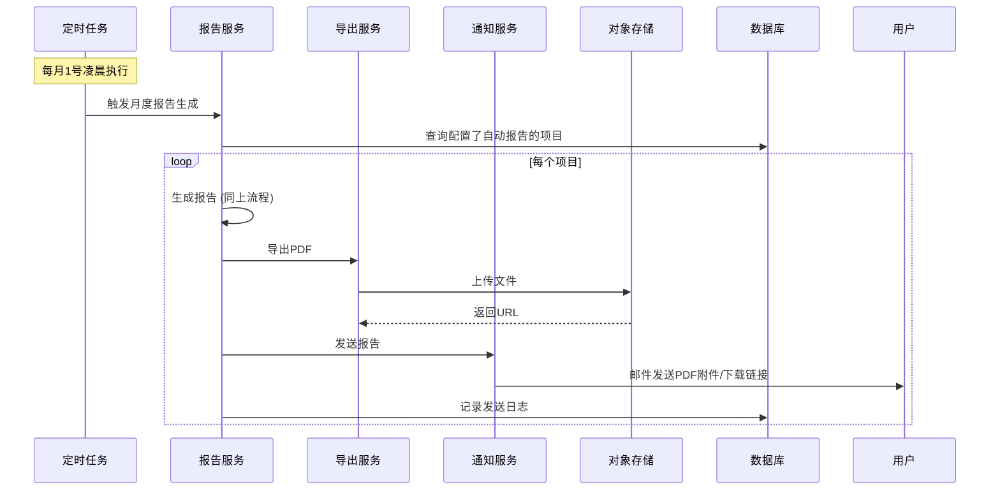
```mermaid
sequenceDiagram
    participant Scheduler as 定时任务
    participant ReportSvc as 报告服务
    participant ExportSvc as 导出服务
    participant Notification as 通知服务
    participant Storage as 对象存储
    participant DB as 数据库
    participant User as 用户

    Note over Scheduler: 每月1号凌晨执行

    Scheduler->>ReportSvc: 触发月度报告生成
    ReportSvc->>DB: 查询配置了自动报告的项目

    loop 每个项目
        ReportSvc->>ReportSvc: 生成报告 (同上流程)
        ReportSvc->>ExportSvc: 导出PDF
        ExportSvc->>Storage: 上传文件
        Storage-->>ExportSvc: 返回URL

        ReportSvc->>Notification: 发送报告
        Notification->>User: 邮件发送PDF附件/下载链接

        ReportSvc->>DB: 记录发送日志
    end
```

---

## 8. 自动化优化时序图

### 8.1 自动化Meta标签优化流程

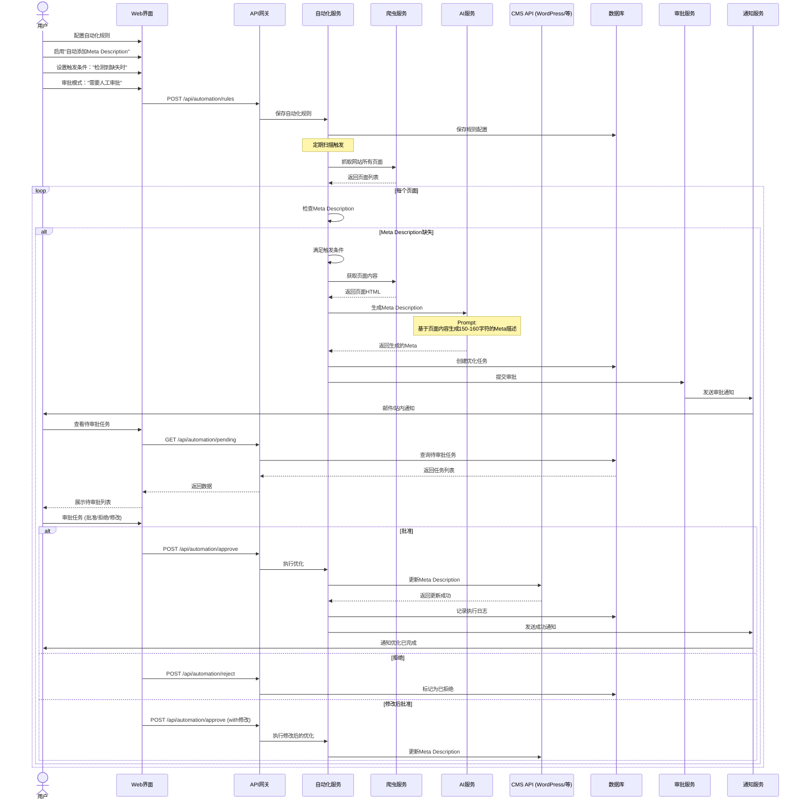
```mermaid
sequenceDiagram
    actor User as 用户
    participant UI as Web界面
    participant API as API网关
    participant AutoSvc as 自动化服务
    participant Crawler as 爬虫服务
    participant AI as AI服务
    participant CMS as CMS API (WordPress/等)
    participant DB as 数据库
    participant Approval as 审批服务
    participant Notification as 通知服务

    User->>UI: 配置自动化规则
    User->>UI: 启用"自动添加Meta Description"
    User->>UI: 设置触发条件："检测到缺失时"
    User->>UI: 审批模式："需要人工审批"

    UI->>API: POST /api/automation/rules
    API->>AutoSvc: 保存自动化规则
    AutoSvc->>DB: 保存规则配置

    Note over AutoSvc: 定期扫描触发

    AutoSvc->>Crawler: 抓取网站所有页面
    Crawler-->>AutoSvc: 返回页面列表

    loop 每个页面
        AutoSvc->>AutoSvc: 检查Meta Description

        alt Meta Description缺失
            AutoSvc->>AutoSvc: 满足触发条件
            AutoSvc->>Crawler: 获取页面内容
            Crawler-->>AutoSvc: 返回页面HTML

            AutoSvc->>AI: 生成Meta Description
            Note over AI: Prompt:<br/>基于页面内容生成150-160字符的Meta描述
            AI-->>AutoSvc: 返回生成的Meta

            AutoSvc->>DB: 创建优化任务
            AutoSvc->>Approval: 提交审批

            Approval->>Notification: 发送审批通知
            Notification->>User: 邮件/站内通知

            User->>UI: 查看待审批任务
            UI->>API: GET /api/automation/pending
            API->>DB: 查询待审批任务
            DB-->>API: 返回任务列表
            API-->>UI: 返回数据
            UI-->>User: 展示待审批列表

            User->>UI: 审批任务 (批准/拒绝/修改)

            alt 批准
                UI->>API: POST /api/automation/approve
                API->>AutoSvc: 执行优化

                AutoSvc->>CMS: 更新Meta Description
                CMS-->>AutoSvc: 返回更新成功

                AutoSvc->>DB: 记录执行日志
                AutoSvc->>Notification: 发送成功通知
                Notification->>User: 通知优化已完成
            else 拒绝
                UI->>API: POST /api/automation/reject
                API->>DB: 标记为已拒绝
            else 修改后批准
                UI->>API: POST /api/automation/approve (with修改)
                API->>AutoSvc: 执行修改后的优化
                AutoSvc->>CMS: 更新Meta Description
            end
        end
    end
```

### 8.2 自动化内部链接建议流程

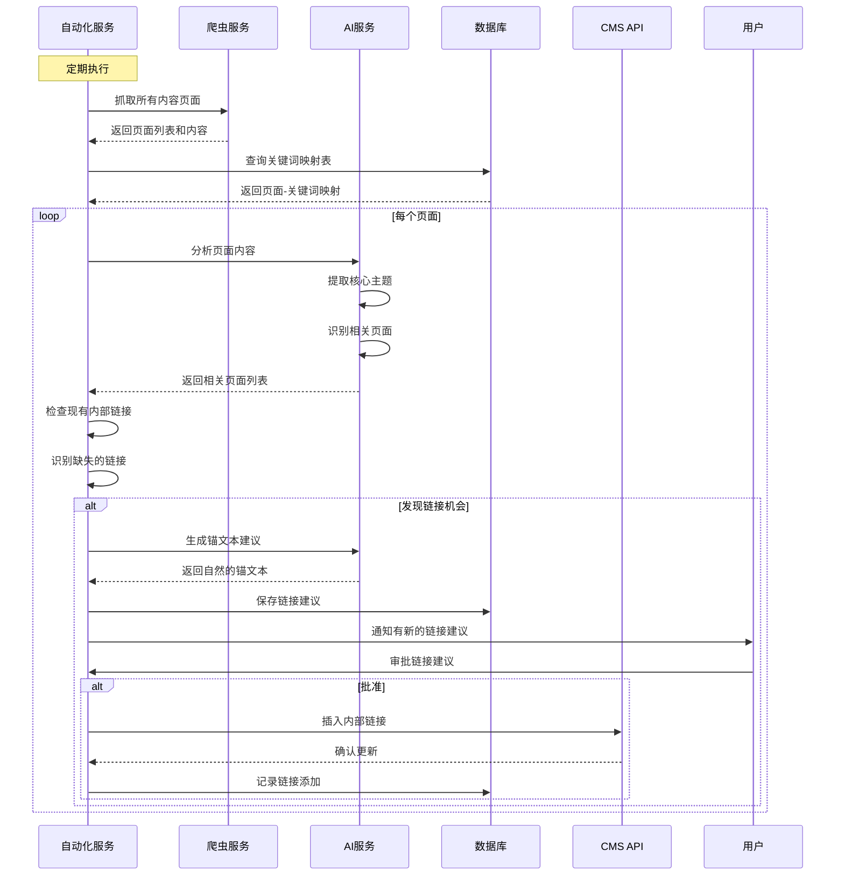
```mermaid
sequenceDiagram
    participant AutoSvc as 自动化服务
    participant Crawler as 爬虫服务
    participant AI as AI服务
    participant DB as 数据库
    participant CMS as CMS API
    participant User as 用户

    Note over AutoSvc: 定期执行

    AutoSvc->>Crawler: 抓取所有内容页面
    Crawler-->>AutoSvc: 返回页面列表和内容

    AutoSvc->>DB: 查询关键词映射表
    DB-->>AutoSvc: 返回页面-关键词映射

    loop 每个页面
        AutoSvc->>AI: 分析页面内容
        AI->>AI: 提取核心主题
        AI->>AI: 识别相关页面
        AI-->>AutoSvc: 返回相关页面列表

        AutoSvc->>AutoSvc: 检查现有内部链接
        AutoSvc->>AutoSvc: 识别缺失的链接

        alt 发现链接机会
            AutoSvc->>AI: 生成锚文本建议
            AI-->>AutoSvc: 返回自然的锚文本

            AutoSvc->>DB: 保存链接建议
            AutoSvc->>User: 通知有新的链接建议

            User->>AutoSvc: 审批链接建议
            alt 批准
                AutoSvc->>CMS: 插入内部链接
                CMS-->>AutoSvc: 确认更新
                AutoSvc->>DB: 记录链接添加
            end
        end
    end
```

---

## 9. 警报通知时序图

### 9.1 排名下降警报流程

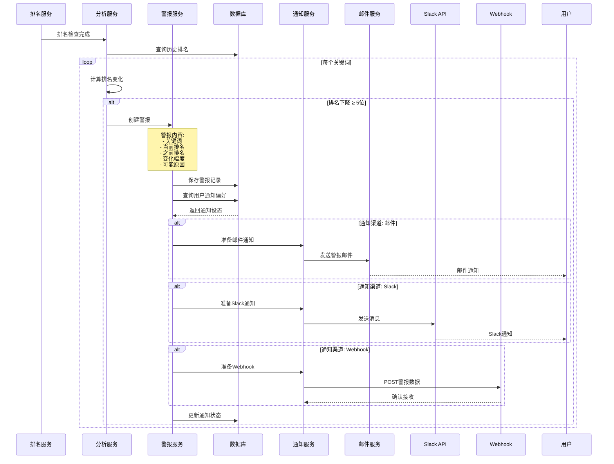
```mermaid
sequenceDiagram
    participant RankSvc as 排名服务
    participant Analytics as 分析服务
    participant Alert as 警报服务
    participant DB as 数据库
    participant Notification as 通知服务
    participant Email as 邮件服务
    participant Slack as Slack API
    participant Webhook as Webhook
    participant User as 用户

    RankSvc->>Analytics: 排名检查完成
    Analytics->>DB: 查询历史排名

    loop 每个关键词
        Analytics->>Analytics: 计算排名变化

        alt 排名下降 ≥ 5位
            Analytics->>Alert: 创建警报
            Note over Alert: 警报内容:<br/>- 关键词<br/>- 当前排名<br/>- 之前排名<br/>- 变化幅度<br/>- 可能原因

            Alert->>DB: 保存警报记录
            Alert->>DB: 查询用户通知偏好
            DB-->>Alert: 返回通知设置

            alt 通知渠道: 邮件
                Alert->>Notification: 准备邮件通知
                Notification->>Email: 发送警报邮件
                Email-->>User: 邮件通知
            end

            alt 通知渠道: Slack
                Alert->>Notification: 准备Slack通知
                Notification->>Slack: 发送消息
                Slack-->>User: Slack通知
            end

            alt 通知渠道: Webhook
                Alert->>Notification: 准备Webhook
                Notification->>Webhook: POST警报数据
                Webhook-->>Notification: 确认接收
            end

            Alert->>DB: 更新通知状态
        end
    end
```

### 9.2 批量通知流程

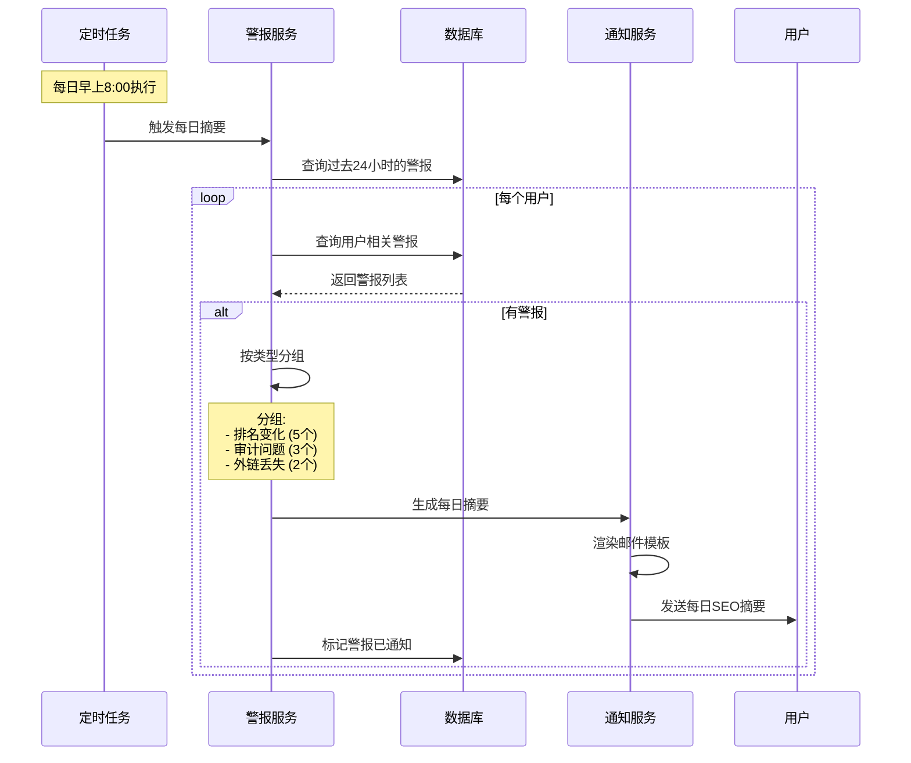
```mermaid
sequenceDiagram
    participant Scheduler as 定时任务
    participant Alert as 警报服务
    participant DB as 数据库
    participant Notification as 通知服务
    participant User as 用户

    Note over Scheduler: 每日早上8:00执行

    Scheduler->>Alert: 触发每日摘要
    Alert->>DB: 查询过去24小时的警报

    loop 每个用户
        Alert->>DB: 查询用户相关警报
        DB-->>Alert: 返回警报列表

        alt 有警报
            Alert->>Alert: 按类型分组
            Note over Alert: 分组:<br/>- 排名变化 (5个)<br/>- 审计问题 (3个)<br/>- 外链丢失 (2个)

            Alert->>Notification: 生成每日摘要
            Notification->>Notification: 渲染邮件模板
            Notification->>User: 发送每日SEO摘要

            Alert->>DB: 标记警报已通知
        end
    end
```

---

## 10. 系统初始化时序图

### 10.1 项目初始化流程

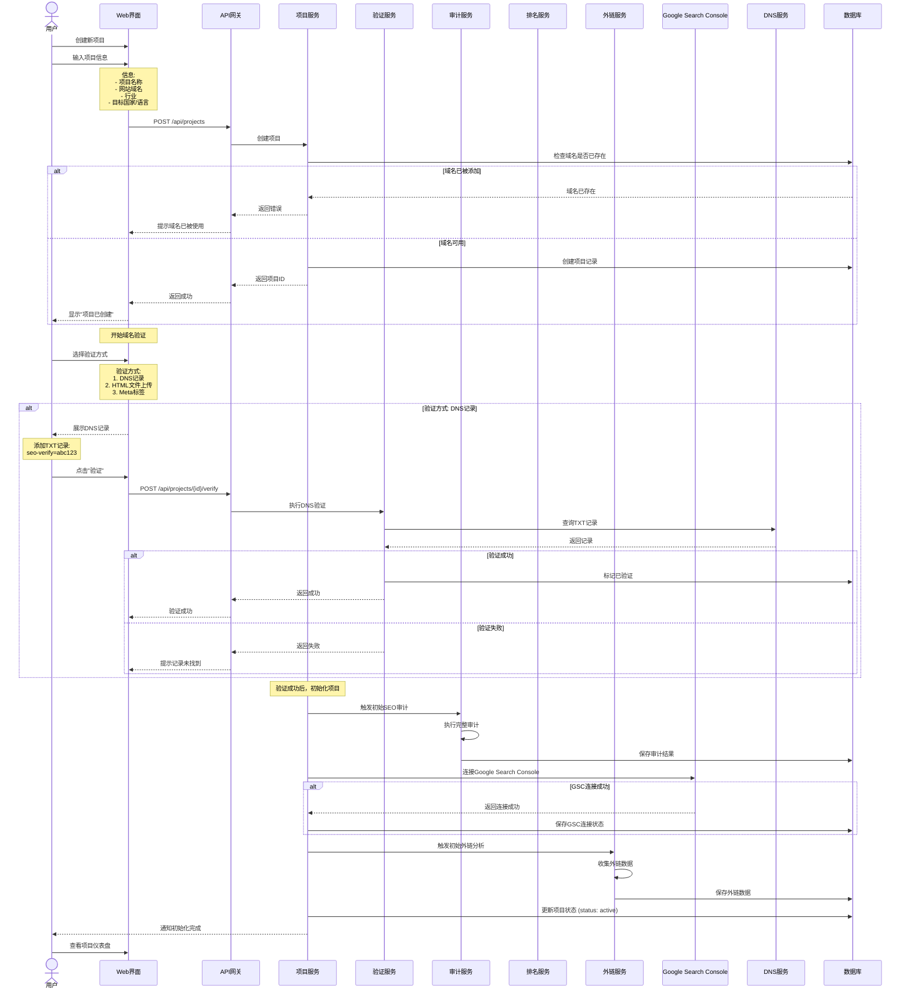
```mermaid
sequenceDiagram
    actor User as 用户
    participant UI as Web界面
    participant API as API网关
    participant ProjectSvc as 项目服务
    participant VerifySvc as 验证服务
    participant AuditSvc as 审计服务
    participant RankSvc as 排名服务
    participant BacklinkSvc as 外链服务
    participant GSC as Google Search Console
    participant DNS as DNS服务
    participant DB as 数据库

    User->>UI: 创建新项目
    User->>UI: 输入项目信息
    Note over UI: 信息:<br/>- 项目名称<br/>- 网站域名<br/>- 行业<br/>- 目标国家/语言

    UI->>API: POST /api/projects
    API->>ProjectSvc: 创建项目

    ProjectSvc->>DB: 检查域名是否已存在
    alt 域名已被添加
        DB-->>ProjectSvc: 域名已存在
        ProjectSvc-->>API: 返回错误
        API-->>UI: 提示域名已被使用
    else 域名可用
        ProjectSvc->>DB: 创建项目记录
        ProjectSvc-->>API: 返回项目ID
        API-->>UI: 返回成功
        UI-->>User: 显示"项目已创建"
    end

    Note over UI: 开始域名验证

    User->>UI: 选择验证方式
    Note over UI: 验证方式:<br/>1. DNS记录<br/>2. HTML文件上传<br/>3. Meta标签

    alt 验证方式: DNS记录
        UI-->>User: 展示DNS记录
        Note over User: 添加TXT记录:<br/>seo-verify=abc123

        User->>UI: 点击"验证"
        UI->>API: POST /api/projects/{id}/verify
        API->>VerifySvc: 执行DNS验证
        VerifySvc->>DNS: 查询TXT记录
        DNS-->>VerifySvc: 返回记录
        alt 验证成功
            VerifySvc->>DB: 标记已验证
            VerifySvc-->>API: 返回成功
            API-->>UI: 验证成功
        else 验证失败
            VerifySvc-->>API: 返回失败
            API-->>UI: 提示记录未找到
        end
    end

    Note over ProjectSvc: 验证成功后，初始化项目

    ProjectSvc->>AuditSvc: 触发初始SEO审计
    AuditSvc->>AuditSvc: 执行完整审计
    AuditSvc->>DB: 保存审计结果

    ProjectSvc->>GSC: 连接Google Search Console
    alt GSC连接成功
        GSC-->>ProjectSvc: 返回连接成功
        ProjectSvc->>DB: 保存GSC连接状态
    end

    ProjectSvc->>BacklinkSvc: 触发初始外链分析
    BacklinkSvc->>BacklinkSvc: 收集外链数据
    BacklinkSvc->>DB: 保存外链数据

    ProjectSvc->>DB: 更新项目状态 (status: active)

    ProjectSvc-->>User: 通知初始化完成
    User->>UI: 查看项目仪表盘
```

### 10.2 用户注册与认证流程

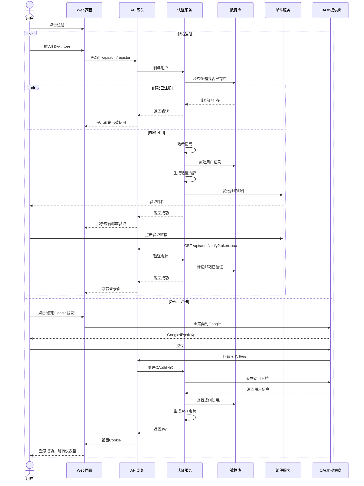
```mermaid
sequenceDiagram
    actor User as 用户
    participant UI as Web界面
    participant API as API网关
    participant AuthSvc as 认证服务
    participant DB as 数据库
    participant Email as 邮件服务
    participant OAuth as OAuth提供商

    User->>UI: 点击注册

    alt 邮箱注册
        User->>UI: 输入邮箱和密码
        UI->>API: POST /api/auth/register
        API->>AuthSvc: 创建用户

        AuthSvc->>DB: 检查邮箱是否已存在
        alt 邮箱已注册
            DB-->>AuthSvc: 邮箱已存在
            AuthSvc-->>API: 返回错误
            API-->>UI: 提示邮箱已被使用
        else 邮箱可用
            AuthSvc->>AuthSvc: 哈希密码
            AuthSvc->>DB: 创建用户记录
            AuthSvc->>AuthSvc: 生成验证令牌

            AuthSvc->>Email: 发送验证邮件
            Email-->>User: 验证邮件

            AuthSvc-->>API: 返回成功
            API-->>UI: 提示查看邮箱验证

            User->>Email: 点击验证链接
            Email->>API: GET /api/auth/verify?token=xxx
            API->>AuthSvc: 验证令牌
            AuthSvc->>DB: 标记邮箱已验证
            AuthSvc-->>API: 返回成功
            API-->>UI: 跳转登录页
        end

    else OAuth注册
        User->>UI: 点击"使用Google登录"
        UI->>OAuth: 重定向到Google
        OAuth-->>User: Google登录页面
        User->>OAuth: 授权
        OAuth->>API: 回调 + 授权码

        API->>AuthSvc: 处理OAuth回调
        AuthSvc->>OAuth: 交换访问令牌
        OAuth-->>AuthSvc: 返回用户信息

        AuthSvc->>DB: 查找或创建用户
        AuthSvc->>AuthSvc: 生成JWT令牌
        AuthSvc-->>API: 返回JWT
        API-->>UI: 设置Cookie
        UI-->>User: 登录成功，跳转仪表盘
    end
```

---

## 总结

本文档详细描述了SEO智能体系统的10个核心流程的时序图，涵盖：

1. **网站SEO审计** - 完整的并行审计流程和失败处理
2. **关键词研究** - 多数据源整合和AI辅助分析
3. **排名监控** - 定时检查和实时查询
4. **内容优化** - 实时反馈和AI内容生成
5. **竞品分析** - 全方位竞品数据收集和对比
6. **外链分析** - 多维度外链评估和机会挖掘
7. **报告生成** - 自定义报告和定期自动报告
8. **自动化优化** - 审批流程和CMS集成
9. **警报通知** - 多渠道通知和批量摘要
10. **系统初始化** - 项目初始化和用户认证

这些时序图详细展示了：
- 各服务间的交互顺序
- 并行处理优化
- 错误处理机制
- 数据流转过程
- 用户交互节点

可作为系统开发的详细技术参考。
