# SEO智能体系统 - 用例图

## 1. 总体用例图

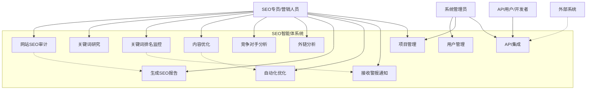

---

## 2. 详细用例说明

### 2.1 网站SEO审计

**用例名称**: 网站SEO审计
**参与者**: SEO专员、系统
**前置条件**: 用户已登录，拥有待审计的网站URL
**主要流程**:

1. 用户输入网站URL
2. 系统验证URL有效性
3. 系统创建审计任务
4. 系统并行执行以下检测：
   - 页面性能分析（Core Web Vitals）
   - 移动友好性检测
   - Meta标签分析
   - 结构化数据验证
   - 内部链接分析
   - 内容质量检查
   - 安全性检查
   - 索引状态检查
5. 系统汇总分析结果
6. AI引擎生成优化建议
7. 系统计算SEO健康评分
8. 系统生成可视化报告
9. 系统通知用户审计完成

**后置条件**: 生成完整的SEO审计报告，包含问题清单和优化建议
**异常流程**:
- URL无效：提示用户重新输入
- 网站无法访问：记录错误，建议用户检查网站可用性
- 审计超时：部分结果展示，标注未完成项

**业务规则**:
- 单次审计最多支持100个页面
- 审计结果保留90天
- 免费用户每月限制5次审计

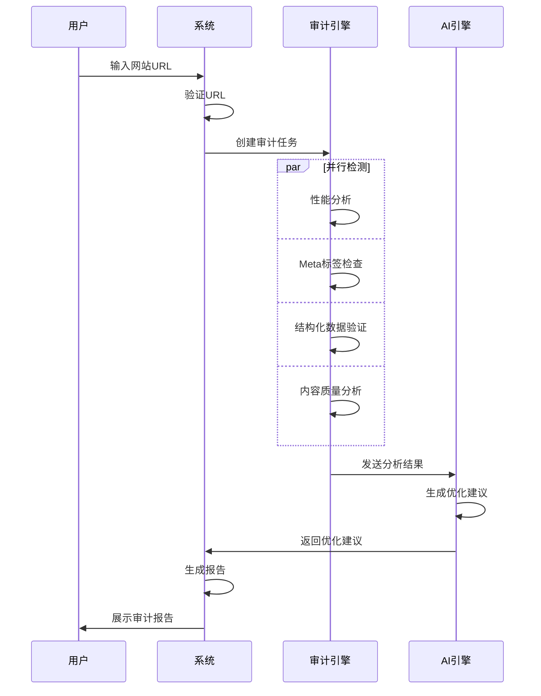

---

### 2.2 关键词研究

**用例名称**: 关键词研究
**参与者**: SEO专员、系统
**前置条件**: 用户已登录，拥有种子关键词或目标主题
**主要流程**:

1. 用户输入种子关键词或主题
2. 用户选择目标国家/语言
3. 系统调用关键词API（Google Keyword Planner, SEMrush等）
4. 系统执行关键词扩展：
   - 相关关键词挖掘
   - 长尾关键词发现
   - 问题型关键词生成
   - LSI关键词提取
5. 系统获取关键词数据：
   - 搜索量
   - 竞争度
   - CPC
   - 搜索趋势
6. AI分析搜索意图分类
7. 系统计算关键词难度评分
8. 系统按优先级排序关键词
9. 展示关键词列表和可视化分析
10. 用户可选择关键词加入监控列表

**后置条件**: 生成关键词列表，包含详细数据和优先级建议
**异常流程**:
- API调用失败：使用缓存数据或提示稍后重试
- 无相关关键词：建议用户调整种子关键词

**业务规则**:
- 单次最多返回500个关键词
- 关键词数据每周更新一次
- 免费用户每月限制50次查询

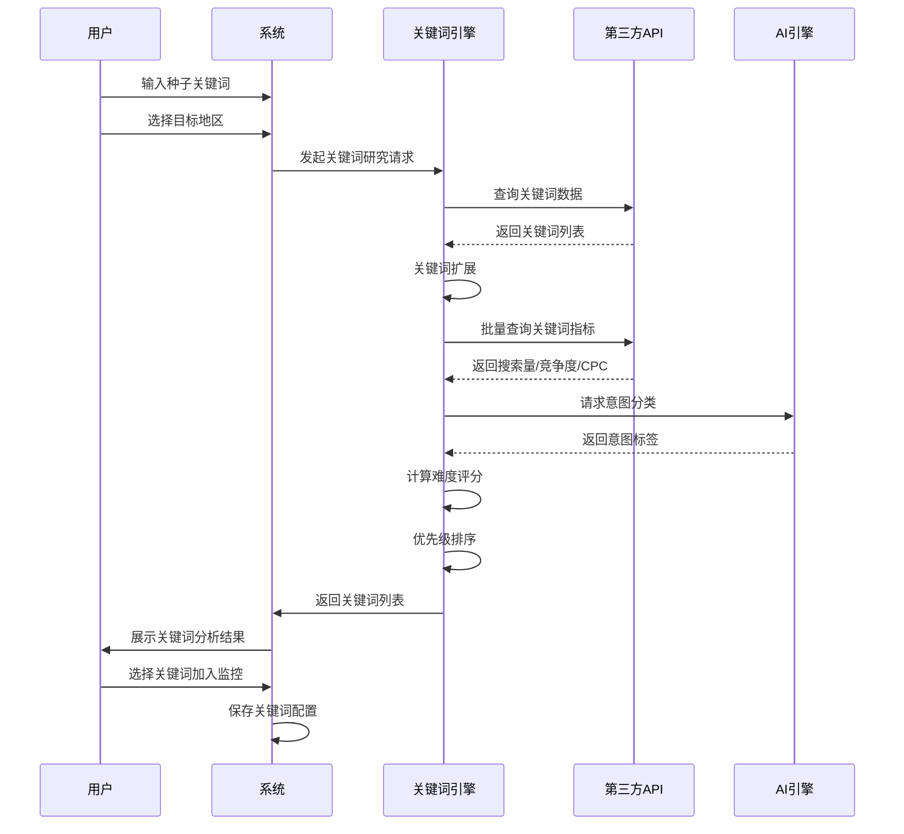

---

### 2.3 关键词排名监控

**用例名称**: 关键词排名监控
**参与者**: SEO专员、系统、定时任务
**前置条件**: 用户已添加关键词到监控列表
**主要流程**:

1. 用户配置监控设置：
   - 选择关键词
   - 设置目标URL
   - 选择搜索引擎（Google/Bing/百度）
   - 选择地域
   - 设置监控频率（每日/每周）
2. 系统保存监控配置
3. 定时任务触发排名检查
4. 系统查询搜索引擎（通过API或爬虫）
5. 系统解析SERP结果
6. 系统提取目标URL排名位置
7. 系统检测特殊SERP特征：
   - Featured Snippet
   - People Also Ask
   - 图片/视频结果
8. 系统存储排名数据
9. 系统分析排名变化
10. 如有显著变化（上升/下降超过阈值），触发警报
11. 更新排名仪表盘

**后置条件**: 排名数据已记录，用户可查看排名趋势
**异常流程**:
- 查询失败：记录错误，下次重试
- 目标URL未出现在前100位：记录为"未排名"

**业务规则**:
- 免费用户最多监控10个关键词
- 排名数据保留6个月
- 显著变化定义为排名变动≥5位

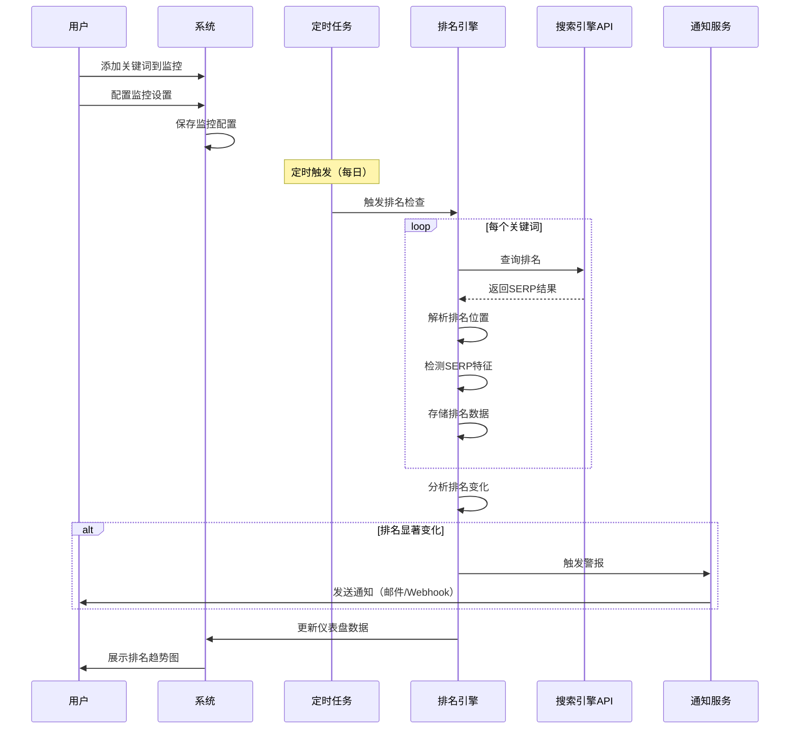

---

### 2.4 内容优化

**用例名称**: 内容优化
**参与者**: 内容编辑、系统
**前置条件**: 用户已选定目标关键词
**主要流程**:

1. 用户输入目标关键词
2. 系统分析Top 10排名页面
3. 系统提取竞品内容特征：
   - 平均内容长度
   - 关键词使用频率
   - 主题覆盖范围
   - 内容结构（标题层级）
   - 多媒体使用情况
4. AI生成内容大纲建议
5. 用户开始编写内容（或粘贴现有内容）
6. 系统提供实时优化建议：
   - 关键词密度检查
   - 可读性评分
   - 标题优化建议
   - Meta描述建议
   - 内部链接建议
   - 图片Alt属性建议
7. 系统计算内容优化评分
8. 用户根据建议修改内容
9. 系统重新评估内容
10. 用户确认内容优化完成

**后置条件**: 内容已优化，符合SEO最佳实践
**异常流程**:
- 目标关键词无排名数据：使用通用SEO最佳实践建议

**业务规则**:
- 内容长度建议基于Top 10平均值
- 关键词密度建议范围：1-3%
- 可读性目标：Flesch Reading Ease ≥ 60

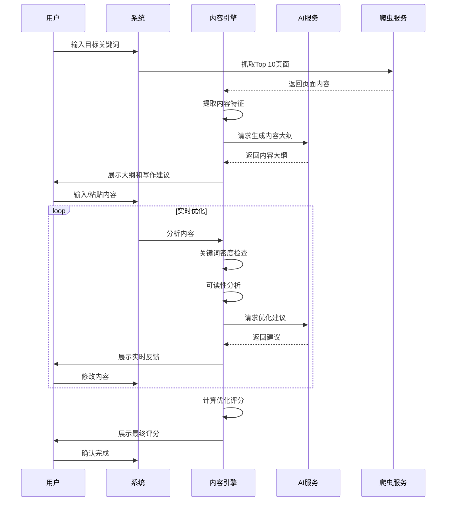

---

### 2.5 竞争对手分析

**用例名称**: 竞争对手分析
**参与者**: SEO专员、系统
**前置条件**: 用户已设置主要竞争对手或由系统自动识别
**主要流程**:

1. 用户输入竞争对手域名，或系统自动识别竞品
2. 系统收集竞品数据：
   - 域名权威度（DA/DR）
   - 自然搜索流量估算
   - 排名关键词数量
   - 外链数量和质量
   - 内容发布频率
3. 系统执行关键词差距分析：
   - 竞品排名但我方未排名的关键词
   - 竞品排名更高的关键词
   - 独特机会关键词
4. 系统分析竞品内容策略：
   - 主要内容主题
   - 内容类型分布（博客/指南/视频等）
   - 内容长度趋势
   - 更新频率
5. 系统分析竞品外链策略：
   - 主要外链来源
   - 高质量外链机会
   - 外链增长趋势
6. 系统生成竞品对比报告
7. AI提供差异化建议

**后置条件**: 生成竞品分析报告，包含可行动的优化机会
**异常流程**:
- 竞品域名无法访问：标注为无效
- API数据不足：使用历史数据或爬虫补充

**业务规则**:
- 最多支持5个竞争对手同时对比
- 竞品数据每周更新一次

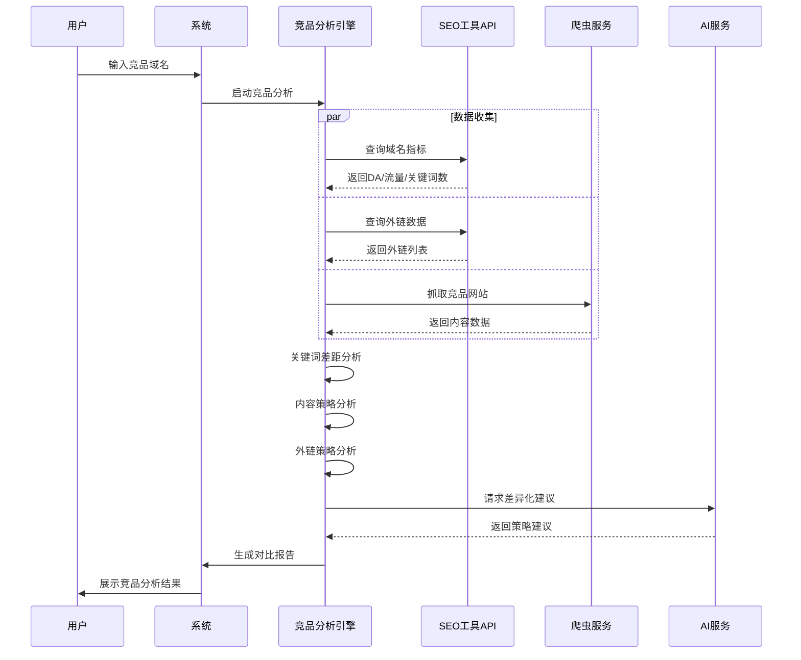

---

### 2.6 外链分析

**用例名称**: 外链分析
**参与者**: SEO专员、系统
**前置条件**: 用户已验证网站所有权
**主要流程**:

1. 用户请求外链分析
2. 系统调用外链数据API（Ahrefs/Majestic/Moz）
3. 系统获取外链列表：
   - 来源域名
   - 来源页面URL
   - 目标页面URL
   - 锚文本
   - Follow/Nofollow
   - 首次发现时间
4. 系统评估外链质量：
   - 域名权威度
   - 页面权威度
   - 相关性评分
   - 流量估算
5. 系统识别有毒外链（垃圾外链）
6. 系统分析锚文本分布
7. 系统分析外链增长趋势
8. 系统挖掘外链机会：
   - 竞品独有的优质外链
   - 行业目录
   - 资源页面
   - 断链建设机会
9. 生成外链分析报告
10. 提供外链建设建议

**后置条件**: 生成外链健康报告和建设建议
**异常流程**:
- API调用失败：使用缓存数据
- 外链数据为空：建议开始外链建设

**业务规则**:
- 有毒外链定义：DA<10且来自无关行业
- 外链数据每月更新一次

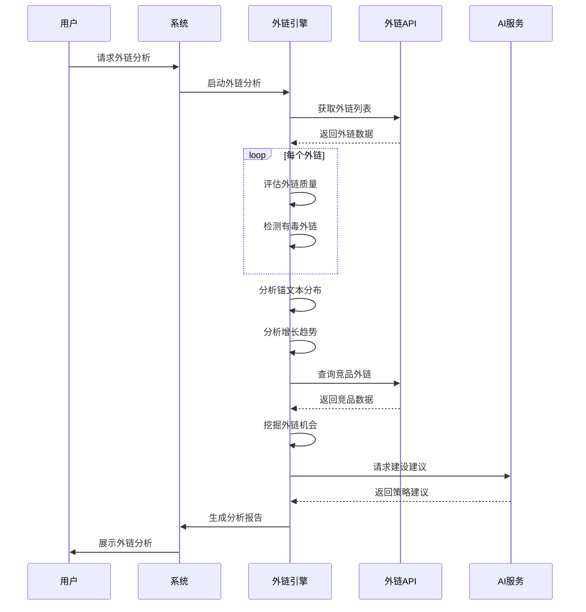

---

### 2.7 生成SEO报告

**用例名称**: 生成SEO报告
**参与者**: SEO专员、系统
**前置条件**: 已有SEO数据（审计、排名、流量等）
**主要流程**:

1. 用户选择报告类型：
   - 周报
   - 月报
   - 季度报告
   - 自定义报告
2. 用户选择报告内容模块：
   - 排名变化
   - 流量分析
   - 审计结果
   - 竞品对比
   - 外链状态
3. 用户选择时间范围
4. 系统收集相关数据
5. 系统生成数据可视化图表：
   - 排名趋势图
   - 流量趋势图
   - 关键词分布图
   - 审计评分对比
6. AI生成报告摘要和洞察
7. AI生成优化建议
8. 系统组装报告
9. 用户预览报告
10. 用户选择导出格式（PDF/Excel/PPT）
11. 系统生成报告文件
12. 用户下载或分享报告

**后置条件**: 生成专业的SEO报告文件
**异常流程**:
- 数据不足：标注数据缺失部分
- 导出失败：重试或更换格式

**业务规则**:
- 报告支持白标（品牌定制）
- 报告模板可自定义
- 免费用户限制PDF导出

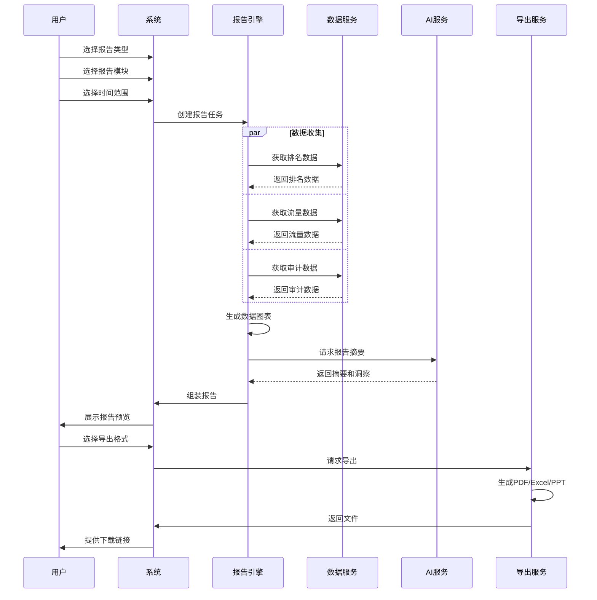

---

### 2.8 自动化优化

**用例名称**: 自动化优化
**参与者**: SEO专员、系统、自动化引擎
**前置条件**: 用户已授权自动优化，网站支持API或CMS集成
**主要流程**:

1. 用户配置自动化规则：
   - 自动添加Meta描述（如缺失）
   - 自动添加图片Alt属性
   - 自动生成内部链接建议
   - 自动添加Schema标记
2. 用户设置自动化触发条件
3. 系统检测到触发条件
4. 自动化引擎执行优化操作
5. 系统记录优化日志
6. 系统通知用户优化结果
7. 用户可审核和回滚操作

**后置条件**: 网站已自动优化，符合SEO最佳实践
**异常流程**:
- 优化失败：回滚操作，通知用户
- 权限不足：提示用户授权

**业务规则**:
- 自动化操作需用户明确授权
- 所有自动化操作可回滚
- 重要修改需人工审核

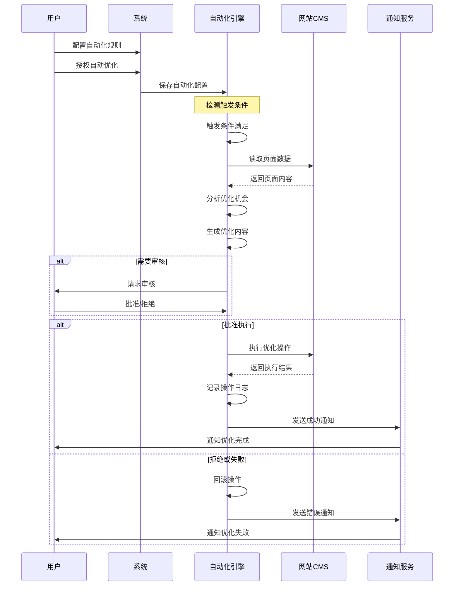

---

### 2.9 接收警报通知

**用例名称**: 接收警报通知
**参与者**: SEO专员、系统、通知服务
**前置条件**: 用户已配置通知偏好
**主要流程**:

1. 用户配置通知设置：
   - 通知渠道（邮件/Slack/Webhook）
   - 通知类型（排名变化/审计问题/外链丢失等）
   - 通知阈值（如排名下降≥5位）
   - 通知频率
2. 系统监控关键指标
3. 系统检测到异常事件
4. 系统判断是否满足通知条件
5. 通知服务组装通知内容
6. 通知服务发送通知
7. 用户接收通知
8. 用户可点击通知查看详情

**后置条件**: 用户及时了解重要SEO变化
**异常流程**:
- 通知发送失败：重试3次
- 用户取消订阅：停止发送

**业务规则**:
- 紧急通知立即发送
- 非紧急通知可批量发送（每日摘要）
- 用户可随时调整通知设置

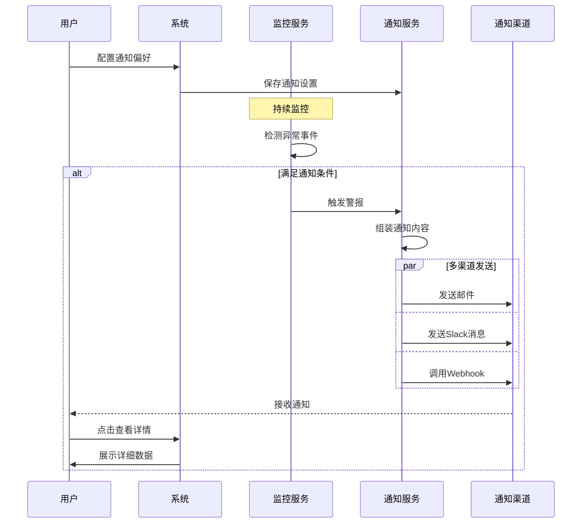

---

### 2.10 项目管理

**用例名称**: 项目管理
**参与者**: SEO专员、系统
**前置条件**: 用户已登录
**主要流程**:

1. 用户创建新项目
2. 用户输入项目信息：
   - 项目名称
   - 网站域名
   - 行业类别
   - 目标国家/语言
   - 主要竞争对手
3. 系统验证域名所有权（通过DNS/HTML验证）
4. 系统初始化项目
5. 系统执行初始SEO审计
6. 用户添加团队成员
7. 用户设置成员权限
8. 用户配置项目设置
9. 系统开始监控项目

**后置条件**: 项目已创建并开始监控
**异常流程**:
- 域名验证失败：提供验证指导
- 域名已被其他用户添加：提示联系管理员

**业务规则**:
- 免费用户最多3个项目
- 域名验证必须通过才能启用所有功能
- 项目可归档但不可删除（数据保留）

---

### 2.11 用户管理

**用例名称**: 用户管理
**参与者**: 系统管理员、系统
**前置条件**: 管理员已登录
**主要流程**:

1. 管理员查看用户列表
2. 管理员可执行以下操作：
   - 创建新用户
   - 编辑用户信息
   - 重置用户密码
   - 分配角色和权限
   - 暂停/激活用户
   - 查看用户活动日志
   - 设置资源配额
3. 系统记录管理操作日志
4. 系统通知受影响用户

**后置条件**: 用户账户已更新
**异常流程**:
- 权限不足：拒绝操作

**业务规则**:
- 只有管理员可执行用户管理
- 所有管理操作需记录审计日志
- 敏感操作需二次确认

---

### 2.12 API集成

**用例名称**: API集成
**参与者**: API用户/开发者、系统
**前置条件**: 用户已注册API访问权限
**主要流程**:

1. 用户申请API访问
2. 系统生成API密钥
3. 用户查看API文档
4. 用户通过API调用系统功能：
   - 网站审计
   - 关键词查询
   - 排名数据获取
   - 报告生成
5. 系统验证API密钥
6. 系统执行请求
7. 系统返回JSON响应
8. 系统记录API调用日志
9. 系统统计API使用量

**后置条件**: API调用成功，数据已返回
**异常流程**:
- API密钥无效：返回401错误
- 超过速率限制：返回429错误
- 请求参数错误：返回400错误

**业务规则**:
- API调用有速率限制（如1000次/天）
- API密钥需定期轮换
- 所有API调用需认证

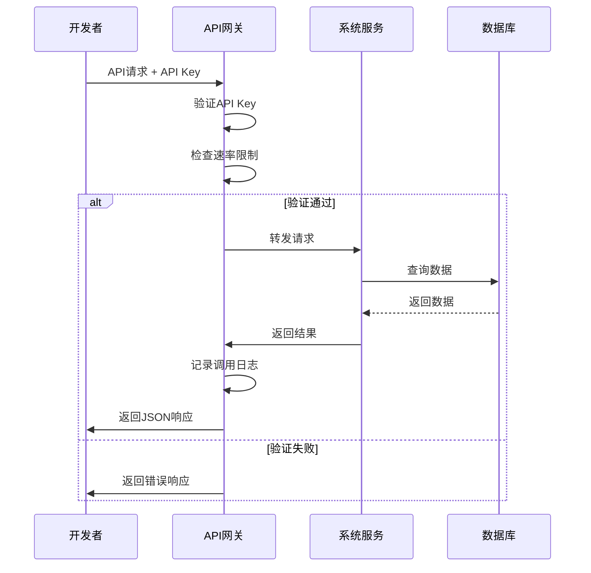

---

## 3. 用例优先级

### 高优先级（MVP核心功能）
1. 网站SEO审计 ⭐⭐⭐
2. 关键词研究 ⭐⭐⭐
3. 关键词排名监控 ⭐⭐⭐
4. 生成SEO报告 ⭐⭐⭐

### 中优先级（重要功能）
5. 内容优化 ⭐⭐
6. 竞争对手分析 ⭐⭐
7. 外链分析 ⭐⭐
8. 项目管理 ⭐⭐

### 低优先级（增强功能）
9. 自动化优化 ⭐
10. 接收警报通知 ⭐
11. 用户管理 ⭐
12. API集成 ⭐

---

## 4. 用例依赖关系

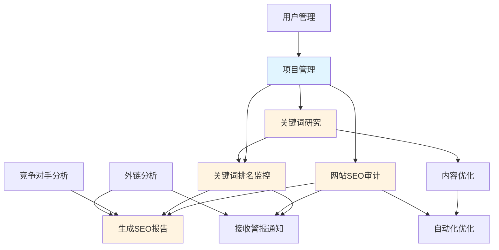

---

## 5. 用例矩阵

| 用例编号 | 用例名称 | 参与者 | 频率 | 复杂度 | 优先级 |
|---------|---------|--------|------|--------|--------|
| UC1 | 网站SEO审计 | SEO专员 | 每周 | 高 | 高 |
| UC2 | 关键词研究 | SEO专员 | 每月 | 中 | 高 |
| UC3 | 关键词排名监控 | 系统/SEO专员 | 每日 | 中 | 高 |
| UC4 | 内容优化 | 内容编辑 | 每周 | 中 | 中 |
| UC5 | 竞争对手分析 | SEO专员 | 每月 | 高 | 中 |
| UC6 | 外链分析 | SEO专员 | 每月 | 中 | 中 |
| UC7 | 生成SEO报告 | SEO专员 | 每周 | 中 | 高 |
| UC8 | 自动化优化 | 系统 | 持续 | 高 | 低 |
| UC9 | 接收警报通知 | SEO专员 | 按需 | 低 | 低 |
| UC10 | 项目管理 | SEO专员 | 按需 | 低 | 中 |
| UC11 | 用户管理 | 管理员 | 按需 | 低 | 低 |
| UC12 | API集成 | 开发者 | 持续 | 中 | 低 |

---

## 总结

本用例图文档详细描述了SEO智能体系统的12个核心用例，涵盖了SEO工程师的主要工作场景。每个用例都包含：

- 详细的流程步骤
- 参与者角色
- 前置和后置条件
- 异常处理流程
- 业务规则
- 时序图

这些用例将指导系统的详细设计和开发工作。
